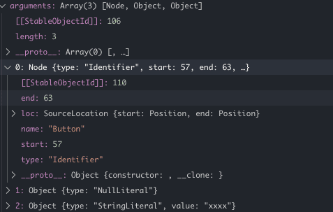

# babel-plugin-import源码解析

这里以`babel-plugin-import`分析一下转译插件的工作原理。

先来看一下`import { Button } from 'antd';`[解析后的AST](https://astexplorer.net/)（记得选择babylon）。

## 准备

### 文档

- [Babel core手册（GitHub）](https://github.com/jamiebuilds/babel-handbook/blob/master/translations/zh-Hans/plugin-handbook.md#toc-stages-of-babel)
- [Babylon AST结点类型枚举（GitHub）](https://github.com/babel/babylon/blob/master/ast/spec.md)
- [babel-traverse（GitHub）：用于操作AST状态--Path的属性及方法](https://github.com/babel/babel/tree/master/packages/babel-traverse/src/path)
- [babel-types（Babel文档）](https://babeljs.io/docs/en/babel-types)
- [@babel/helper-module-imports（Babel文档）](https://babeljs.io/docs/en/next/babel-helper-module-imports.html)

- [ESTree规范（MDN）](https://developer.mozilla.org/en-US/docs/Mozilla/Projects/SpiderMonkey/Parser_API)

## 本地调试结果

先来看一下，以如下方式引用`Button组件`时的转换结果。

```js
import { Button } from 'antd';
ReactDOM.render(<Button>xxxx</Button>);
```

```js
require('@babel/register'); // node未完全支持ES6，运行时对ES6转码（dev）
const babel = require('@babel/core');
const types = require('@babel/types');
const plugin = require('../src/index.js').default;

const visitor = plugin({types});
const code = `
    import { Button } from 'antd';
    ReactDOM.render(<Button>xxxx</Button>);
`;

const result = babel.transform(code, {
    presets: ['umi'],
    plugins: [
        [
            visitor,
            {
                libraryName: 'antd',
                libraryDirectory: 'es',
                style: true
            }
        ]
    ]
});
console.log(result.code);
// "use strict";

// 这个是@babel/runtime的helper函数
// var _interopRequireDefault = require("~/Desktop/code/babel-plugin-import/node_modules/_babel-preset-umi@1.6.1@babel-preset-umi/node_modules/@babel/runtime/helpers/interopRequireDefault");

// var _react = _interopRequireDefault(require("react"));
// require("antd/es/button/style");
// var _button = _interopRequireDefault(require("antd/es/button"));
// ReactDOM.render(_react.default.createElement(_button.default, null, "xxxx"));
```

## 源码分析（version: 1.12.1）

[babel-plugin-import的GitHub地址](https://github.com/ant-design/babel-plugin-import)。

根据`webpack`的`resolve.mainFields`的默认配置，入口一般会选用`package.json`的`main`字段，
即`lib/index.js`，这是build后`comminjs规范`文件，源码入口还是在`src/index.js`。

### 入口文件 /src/index.js

已知Babel进入结点时，是以`访问者模式（visitor）`获取结点信息，并进行相关操作。

入口文件的逻辑很清晰，会导出一个函数，该函数接收一有属性types（即`babel-types`）的对象参数，

返回一个有访问者属性visitor的对象，而visitor对象中定义了对于各结点的访问函数，这样就可以获取具体结点以做出不同的处理。

```js
import assert from 'assert'; // 断言
import Plugin from './Plugin';
// babel调用插件时，会将babel-types作为参数传入
export default function ({ types }) {
  let plugins = null; // plugin数组，元素为Plugin实例

  // 注册各结点的访问方法
  function applyInstance(method, args, context) {
    for (const plugin of plugins) {
      if (plugin[method]) {
        plugin[method].apply(plugin, [...args, context]);
      }
    }
  }
  const Program = {
    // path可以看成结点的软链接，有一系列属性和操作方法；opts为插件选项。
    enter(path, { opts = {} }) {
      // Init plugin instances once.
      if (!plugins) {
        assert(opts.libraryName, 'libraryName should be provided');
        plugins = [
          new Plugin(
            opts.libraryName,
            opts.libraryDirectory,
            opts.style,
            opts.camel2DashComponentName,
            opts.camel2UnderlineComponentName,
            opts.fileName,
            opts.customName,
            opts.transformToDefaultImport,
            types
          ),
        ];
      }
      applyInstance('ProgramEnter', arguments, this); // 注册根结点enter方法
    },
    exit() {
      applyInstance('ProgramExit', arguments, this); // 注册根结点exit方法
    },
  };
  const methods = [
    'ImportDeclaration',
    'CallExpression',
    'MemberExpression',
    'Property',
    'VariableDeclarator',
    'ArrayExpression',
    'LogicalExpression',
    'ConditionalExpression',
    'IfStatement',
    'ExpressionStatement',
    'ReturnStatement',
    'ExportDefaultDeclaration',
    'BinaryExpression',
    'NewExpression',
    'ClassDeclaration',
  ];
  const ret = {
    visitor: { Program },
  };
  // 将methods数组元素映射的访问函数全部注册
  for (const method of methods) {
    ret.visitor[method] = function () { // eslint-disable-line
      applyInstance(method, arguments, ret.visitor);  // eslint-disable-line
    };
  }
  return ret; // 返回访问对象
}
```

### /src/Plugin.js

以下描述，默认均为Plugin类的构造函数或实例方法，重点分析`ImportDeclaration`和`CallExpression`。

- 构造函数

```js
  constructor(
    libraryName, // 包名
    libraryDirectory, // 路径，esModule 和 commonjs包 (default: lib)
    style, // less或css文件，less模块优势是可定制变量（choice: true, 'css'; default: false)
    camel2DashComponentName, // 驼峰的大写字母转'-'处理 (default: true)
    camel2UnderlineComponentName, // 驼峰的大写字母转'_'处理
    fileName, // 文件名
    customName, // 自定义导入文件名，一般会是个函数，也兼容了绝对路径的方式
    transformToDefaultImport,
    types, // babel-types
    index = 0
  ) {
    this.libraryName = libraryName;
    this.libraryDirectory = typeof libraryDirectory === 'undefined'
      ? 'lib'
      : libraryDirectory;
    this.camel2DashComponentName = typeof camel2DashComponentName === 'undefined'
      ? true
      : camel2DashComponentName;
    this.camel2UnderlineComponentName = camel2UnderlineComponentName;
    this.style = style || false;
    this.fileName = fileName || '';
    this.customName = normalizeCustomName(customName);
    this.transformToDefaultImport = typeof transformToDefaultImport === 'undefined'
      ? true
      : transformToDefaultImport;
    this.types = types;
    this.pluginStateKey = `importPluginState${index}`;
  }

  // 其中，normalizeCustomName辅助函数，用以自定义导入文件名，兼容函数和绝对路径两种格式
  function normalizeCustomName(originCustomName) {
    // If set to a string, treat it as a JavaScript source file path.
    if (typeof originCustomName === 'string') {
      const customNameExports = require(originCustomName);
      return typeof customNameExports === 'function'
        ? customNameExports : customNameExports.default;
    }

    return originCustomName;
  }
```

- state维护

```js
  // state是个状态的集合，包括pwd、处理文件信息、传入的参数配置信息，当然也可以存放插件处理时的自定义状态
  getPluginState(state) {
    if (!state[this.pluginStateKey]) {
      state[this.pluginStateKey] = {};  // eslint-disable-line
    }
    return state[this.pluginStateKey];
  }
```

- 根结点

```js
  ProgramEnter(path, state) {
    const pluginState = this.getPluginState(state);
    pluginState.specified = Object.create(null); // 用于存储导入说明符
    pluginState.libraryObjs = Object.create(null); // 用于存储default和命名空间的导入说明符
    pluginState.selectedMethods = Object.create(null);
    pluginState.pathsToRemove = []; // 准备在退出时删除的访问路径
  }

  ProgramExit(path, state) {
    this.getPluginState(state).pathsToRemove.forEach(p => !p.removed && p.remove());
  }
```

- 语句：import { Button } from 'antd';

```js
  ImportDeclaration(path, state) {
    const { node } = path;
    // 注意结点的两个重要字段：specifiers和source；
    // specifiers：表示import导入的结点数组；
    //    specifiers各元素中imported表示导出模块的变量，local表示导入进来后自定义的变量（import {Button as MyButton} from 'antd'）
    // source：表示导入的模块结点（例如'antd'）

    // path maybe removed by prev instances.
    if (!node) return;

    const { value } = node.source; // 即字符串字面量的值：'antd'
    const libraryName = this.libraryName; // 插件实例属性：'antd'
    const types = this.types; // babel-type
    const pluginState = this.getPluginState(state); // 缓存state
    if (value === libraryName) {
      node.specifiers.forEach(spec => {
        if (types.isImportSpecifier(spec)) {
           // 即pluginState.specified.MyButton = Button
          pluginState.specified[spec.local.name] = spec.imported.name;
        } else { // 匹配ImportDefaultSpecifier和ImportNamespaceSpecifier
          pluginState.libraryObjs[spec.local.name] = true;
        }
      });
      pluginState.pathsToRemove.push(path); // 准备ProgramExit时移除
    }
  }
```

- 语句：ReactDOM.render(\<Button>xxxx\</Button>);

对于`ReactDOM.render`表达式节点

```js
  MemberExpression(path, state) {
    // 成员表达式(引用对象成员)
    // object为引用对象
    // property为属性名称
    // computed：为false时，是表示用点来引用成员，property是个Identifier；为true时，是用中括号来引用成员，property是个Expression，名称是表达式的结果值
    const { node } = path;
    const file = (path && path.hub && path.hub.file) || (state && state.file);
    const pluginState = this.getPluginState(state);

    // multiple instance check.
    if (!node.object || !node.object.name) return;

    if (pluginState.libraryObjs[node.object.name]) {
      path.replaceWith(this.importMethod(node.property.name, file, pluginState));
    } else if (pluginState.specified[node.object.name]) {
      node.object = this.importMethod(pluginState.specified[node.object.name], file, pluginState);
    }
  }
```

在经过@babel/preset-react预设，有将arguments的JSXElement`<Button>xxxx</Button>`转化成`React.createElement(Button, null, "xxxx");`


```js
    CallExpression(path, state) {
    // 函数调用表达式，
    // 其中callee为表达式节点，表示函数；arguments是一个数组，元素是表达式节点（函数参数）。
    const { node } = path;
    const file = (path && path.hub && path.hub.file) || (state && state.file);
    const { name } = node.callee;
    const types = this.types;
    const pluginState = this.getPluginState(state);

    // 若callee是一个标识符（如：变量，函数，属性名，表达式，甚至ES6的解构）
    if (types.isIdentifier(node.callee)) {
      if (pluginState.specified[name]) {
        node.callee = this.importMethod(pluginState.specified[name], file, pluginState);
      }
    }

    node.arguments = node.arguments.map(arg => {
      const { name: argName } = arg;
      // 准备转换，小心作用域 path.scope.bindings
      if (pluginState.specified[argName] &&
        path.scope.hasBinding(argName) &&
        path.scope.getBinding(argName).path.type === 'ImportSpecifier') {
        // 核心转换逻辑
        return this.importMethod(pluginState.specified[argName], file, pluginState);
      }
      return arg;
    });
  }
```

- 核心转换逻辑：importMethod函数

```js
  import { join } from 'path';
  // 用于导入node文件模块，文档查看 https://babeljs.io/docs/en/next/babel-helper-module-imports.html
  import { addSideEffect, addDefault, addNamed } from '@babel/helper-module-imports';

  importMethod(methodName, file, pluginState) { // methodName: 'Button'
    if (!pluginState.selectedMethods[methodName]) {
      // 取到定制传入的配置
      const libraryDirectory = this.libraryDirectory;
      const style = this.style;
      const transformedMethodName = this.camel2UnderlineComponentName  // eslint-disable-line
        ? transCamel(methodName, '_')
        : this.camel2DashComponentName
          ? transCamel(methodName, '-')
          : methodName;
      // 兼容windows路径，path.join('antd/es/button') == 'antd/es/button'; 注意path.join仅拼接，path.resolve才会返回绝对路径
      // 根据node的路径检索规则，会向根路径回溯，找到最近的 node_modules/antd/es/button
      const path = winPath(
        this.customName ? this.customName(transformedMethodName) : join(this.libraryName, libraryDirectory, transformedMethodName, this.fileName) // eslint-disable-line
      );
      pluginState.selectedMethods[methodName] = this.transformToDefaultImport  // eslint-disable-line
        ? addDefault(file.path, path, { nameHint: methodName })
        : addNamed(file.path, methodName, path);
      if (style === true) {
        addSideEffect(file.path, `${path}/style`);
      } else if (style === 'css') {
        addSideEffect(file.path, `${path}/style/css`);
      } else if (typeof style === 'function') {
        const stylePath = style(path, file);
        if (stylePath) {
          addSideEffect(file.path, stylePath);
        }
      }
    }
    return Object.assign({}, pluginState.selectedMethods[methodName]);
  }
```

## Reference

- [深入Babel，这一篇就够了](https://juejin.im/post/5c21b584e51d4548ac6f6c99#heading-1)
