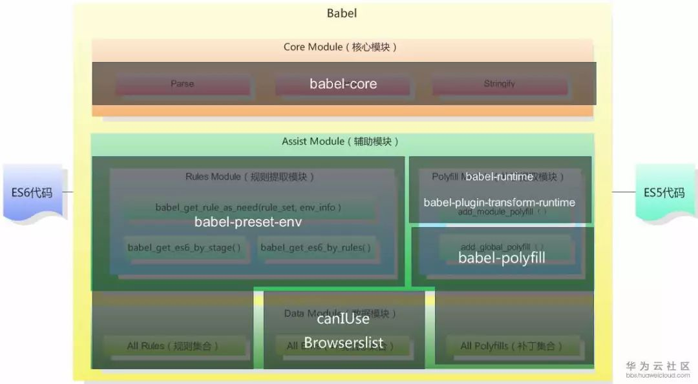

# Babel初见


>传说古时候一群人想建一个通天塔，去天上看看上帝在干什么。上帝于是挥挥手，让这群人说不同的语言，于是他们再也不能顺畅沟通，塔也就建不起来了。

由于各个浏览器对JS版本的支持不同，很多优秀的新语法不能直接在浏览器中运行。babel 因此而生。

>Babel is a JavaScript compiler. [Babel官方文档](https://babeljs.io/)

## Babel 编译

babel 总共分为三个阶段：解析，转换，生成。


### plugins：transform 的载体

babel 自 6.0 起，就不再对代码进行转换。现在只负责图中的 parse 和 generate 流程，转换代码的 transform 过程全都交给`plugin`去做。所以没有配置任何`plugin`时，经过 babel 输出的代码是没有改变的。

例如，转换模版字面量：

```js
const str = 'world'
let hello = `hello ${str}`;
```

需要配置babel文件

```json
{
  "plugins": ["transform-es2015-template-literals"],// 转译模版字符串的 plugins
  "presets": ["env", "stage-2"]
}
```

### presets：babel plugin集合的预设

>当前 babel 推荐使用 babel-preset-env 替代 babel-preset-es201X , 前者包含后者的所有语法编译，并且可以根据项目运行平台的支持情况自行选择编译版本。

plugins 与 presets 同时存在的执行顺序:

- 先执行 plugins 的配置项,再执行 presets 的配置项；
- plugins 配置项，按照声明顺序执行；
- presets 配置项，按照声明逆序执行。

### babel-polyfill

babel-polyfill的作用是：提供ES6内置方法和函数转化垫片(shim)，如Map,Set,Promise等

对上文配置稍作改动：

```json
{
  "plugins": ["transform-es2015-template-literals"],// 转译模版字符串的 plugins
  "presets": [
    ["env", {
      // 是否自动引入 polyfill，开启此选项必须保证已经安装了babel-polyfill
      // “usage” | “entry” | false, defaults to false.
      "useBuiltIns": "usage"
    }],
    "stage-2"
  ]
}
```

useBuiltIns 参数说明：

- false: 不对 polyfills 做任何操作
- entry: 根据 target 中浏览器版本的支持，将 polyfills 拆分引入，仅引入有浏览器不支持的 polyfill
- usage(新)：检测代码中 ES6/7/8 等的使用情况，仅仅加载代码中用到的 polyfills

babel-polyfill的引入，会使打包后整个文件体积变大，并且有全局变量污染问题，后者可以通过`babel-plugin-transform-runtime`解决。

## 各司其职的Babel


