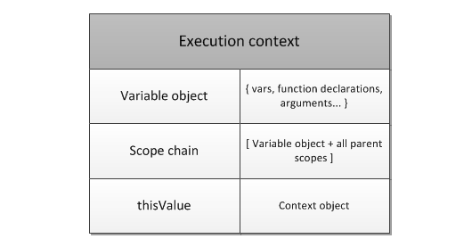

# JS核心

## 快速切入

`GUI渲染线程`从首行开始解析`HTML文件`以构建DOM树，当解析到`script`标签（无defer、async属性）

- 如果这是个行内标签，`GUI渲染线程`随机被挂起，`JS引擎线程`开始解析（其实这也是script标签写在`HTML结构`前面，造成白屏的原因）。
- 如果这是个外链标签，`渲染进程`会开启`http请求线程`去请求资源，在该资源`返回并解析`之前，
`GUI渲染线程`不会跨过script标签去继续构建DOM树（现代浏览器有`资源预请求优化`，但不会破坏DOM树构建规则）。

当前章节，前提都建立在这里————`JS引擎线程`开始执行。

## JS的生命周期

对于任何计算机语言，都是`用规定的文法，去表达特定语义，最终操作运行时的`一个过程。即：

- 文法
  - 词法（直接量、关键字、运算符等）
  - 语法（它和语义一一对应，包括：表达式、语句、函数、对象、模块等）
- 语义
- 运行时
  - 类型（数据结构，包括：对象、数字、字符串，或者细分为堆、栈、链表等）
  - 执行过程（算法）

## JS的解释阶段

**JS是解释型语言，所以它无需提前编译（花大量时间准备的那种），而是由解释器实时运行。**

处理过程可以简述如下：

1. 读取代码，进行词法分析（Lexical analysis），然后将代码分解成词元（atomic token），类似于`foo` `=` `10`。
2. 对token进行语法分析（parsing），然后将其整理成抽象语法树（abstract syntax tree）。
3. 使用翻译器（translator），将代码转为字节码（bytecode）（如Chrome的V8跳过了该步骤）。
4. 使用字节码解释器（bytecode interpreter），将字节码转为CPU直接执行的机器码。

**JIT即时编译：出现的背景**
为了提高运行速度，现代浏览器一般采用即时编译（JIT-Just In Time compiler），
即字节码只在运行时编译，用到哪一行就编译哪一行，如果一段代码运行超过一次（warm），JIT编译器就把编译结果缓存（inline cache）。
这样整个程序的运行速度能得到显著提升。比如`for(i=0; i < 1000; i++){ sum += i; }`如果仅解释，`sum += i;`莫非要转换1000次。

**核心的JIT编译器将源码编译成机器码运行。**

### JS解释器做的那些微小工作

- **变量提升：**

  基于上述步骤，`声明提升`就容易理解了，在文法解析的过程中会为声明语句`在数据作用域中分配内存`，这只是JS
  解释器处理事情的方式，而不会为此付出代价（比如把声明提升到第一行云云），至于为什么const不可以，这是个`VO变量对象`的概念，后面详述。
- **分号补全**。

  首先，和Java一样，JS执行也是需要分号的，没有的会进行分号补全（Semicolon Insertion），即按照一定的规则，在适当位置补充分号。

  - 当有换行符（包括含有换行符的多行注释），并且下一个token没法跟前面的语法匹配时，会自动补分号。
  - 当有`}`时，如果缺少分号，会补分号。
  - 程序源代码结束时，如果缺少分号，会补分号。

  ```js
  function b() {
    return
    {
        a: 'a'
    };
  }
  // 这个函数执行会返回undefined，原因就是分号补全机制，它变成了
  function b() {
    return;
    {
        a: 'a'
    };
  }
  ```

## JS的执行阶段

### 执行上下文栈（Execution Context Stack）

在ECMASscript中的代码有三种类型：global、function和eval，它们都有各自的执行上下文。

即时是同一个函数被多次调用，每次也都会创建不同的上下文。而这种一个上下文激活另一个上下文，一层层的调用下去。
这种实现方式是典型的`栈`结构，于是我们称其为**上下文堆栈**。

激活其它上下文的某个上下文被称为**caller（调用者）**，被激活的上下文称为**callee（被调用者）**。

**过程简述：**

1. 首次载入脚本，全局执行上下文（global execution context）入栈，它是堆栈中最底部的元素，不可被弹出。
2. 全局程序开始初始化，生成必要的对象（objects）和函数（functions），当然也会激活一些已初始化的方法并在初始化后，等待异步事件可能触发的方法。
3. 然后每进入后者的上下文环境，就将其压入执行栈的顶部。
4. 一旦对应的上下文执行完毕，就从栈顶弹出，并将上下文控制权交给当前的栈。
5. 这样依次执行（最终都会回到全局执行上下文）。


如果程序执行完毕后被弹出执行栈，若是没有被引用（没有形成闭包），那么这个函数中用到的内存就会被垃圾处理器自动回收。

### 执行上下文（Execution Context）

每个执行上下文都可以抽象为一个对象，且都有一系列的属性（即上下文状态state）主要有以下三个



- 变量对象(variable object)
- this指针(this value)
- 作用域链(scope chain)

### VO（变量对象）与AO（活动对象）

VO（variable object）是与执行上下文相关的`数据作用域(scope of data)` ，也就是`变量提升`概念中为声明语句开辟内存的存在。
包括var声明（VariableDeclaration）、函数声明（FunctionDeclaration）和函数形式参数（function formal parameters）。

AO（activation object)，当函数被调用者激活，AO就被创建了，除去存储变量与函数声明之外，还包含普通参数(formal parameters)和特殊参数arguments对象。

- 在函数上下文中：VO === AO
- 在全局上下文中：VO === this === global

### 作用域链（Scope Chains）

作用域链是一个 对象列表(list of objects) ，用以检索上下文代码中出现的 标识符(identifiers) 。原理和原型链很相似。

标示符（Identifiers）可以理解为变量名称、函数声明和普通参数。如果关注一下AST，对这个名词应该不会陌生。

```md
  在函数上下文中，查找一个变量foo
  如果函数的VO中找到了，就直接使用
  否则去它的父级作用域链中（__parent__）找
  如果父级中没找到，继续往上找
  直到全局上下文中也没找到就报错
```


注意：with或catch可以改变作用域链。而这些对象都是一些简单对象，他们也会有原型链。这样的话，作用域链会从两个维度来搜寻。

1. 首先在原本的作用域链
2. 每一个链接点的作用域的链（如果这个链接点是有prototype的话）

```js
Object.prototype.x = 10;
var w = 20;
var y = 30;
console.log(x); // 10
(function foo() {
  var w = 40;
  var x = 100;
  // "x" 可以从"Object.prototype"得到，注意值是10哦。因为{z: 50}是从它那里继承的
  with ({z: 50}) {
    console.log(w, x, y , z); // 40, 10, 30, 50
  }
  // 在"with"对象从作用域链删除之后，x又可以从foo的上下文中得到了，注意这次值又回到了100哦
  console.log(x, w); // 100, 40
  console.log(window.w); // 20
})();
```

之所以要提及with，是因为Vue源码的模版解析模块就是这么做的，Vue渲染函数如下所示：

```js
function render () {
  with (this) {
    return _c('div',{
        on:{"click":change}
      },[
        _c('span',[_v(_s(number))]),
        _v(" "),
        _c('span',[_v(_s(name))])
      ]
    )
  }
}
```

Vue中使用with关键字的片段代码如下，主要通过proxy来拦截AST语言树中涉及到的变量以及方法，并且判断是否AST语言树中是否存在为定义的变量及方法，至于为什么Vue会使用with关键字。[查看Vue作者回答](https://github.com/vuejs/vue/issues/3923)，大概意思：Vue并没有对模板中的JS表达式进行ast语法分析，如果要移除with，就需要对其进行ast语法分析，并且还需要一个专门的解释器对ast语法树进行解释，两个并行的解析器，维护成本高。

```js
 export function generate (
    ast: ASTElement | void,
    options: CompilerOptions
  ): CodegenResult {
    const state = new CodegenState(options)
    const code = ast ? genElement(ast, state) : '_c("div")'
    return {
      render: `with(this){return ${code}}`,
      staticRenderFns: state.staticRenderFns
    }
  }
```

### This指针

this是执行上下文环境的一个属性，而不是某个变量对象的属性。它可以称为上下文对象（context object）(激活执行上下文的上下文)。

基于这个特点：

- 和变量不同，this是`没有`一个往作用域链中，类似搜寻变量的过程。
- this不可被赋值（Python有个类似的self参数，它可以在执行过程中被改变）。
- 在global context(全局上下文)中，this的值就是指全局这个对象（在浏览器环境就是window）。
- **this是由每一次caller提供，caller是通过调用表达式（call expression）产生的（也就是这个函数如何被激活调用的）。**

```js
function foo() {
  console.log(this);
}
// caller 激活 "foo"这个callee，并且提供"this"给这个 callee
foo(); // window
foo.prototype.constructor(); // foo.prototype
var bar = {
  baz: foo
};
bar.baz(); // bar
(bar.baz)(); // bar
(bar.baz = bar.baz)(); // window
(bar.baz, bar.baz)(); // window
(false || bar.baz)(); // window
var otherFoo = bar.baz;
otherFoo(); // window
```

### （词法）闭包（（lexical） closure）

**闭包的形态和背景**

- 函数可以作为参数被传递给其他函数使用

  这个函数被称为`funargs`（泛函参数，`functional arguments`的缩写），接收`funargs`的函数被称之为`高阶函数(higher-order functions)`。 

- 其他函数的运行时会返回函数。

  这些返回的函数被称为`function valued函数`(有functional value的函数)。

这两个子问题被称为`Funarg problem` (泛函参数问题)，这时需要引入闭包(closures)的概念，直观表现就是`函数的[[Scope]]属性`。

- **表象1：`向上查找的函数参数问题（upward funarg problem）`**

  ***背景***：当一个函数从其他函数返回到外部的时候，这个问题将会出现。

  要能够在外部上下文结束时，进入外部上下文访问变量。`内部函数`在<font color=purple size=4>创建的时候（at creation moment）</font>需要将前者存储进自己的[[Scope]]属性中所对应的父级所用域。然后当这个内部函数被激活时，其上下文的作用域链表现为激活对象与[[Scope]]属性的组合。

  > 作用域链 = 活动对象 + [[Scope]]

  ***关键点***：函数在被创建时保存外部作用域，因为后者(saved scope chain) 将会在未来的函数调用中用于变量查找。这种`创建时的作用域`即`静态作用域（static/lexical scope）`。

  ```js
  function foo() {
    var x = 10;
    return function bar() {
      console.log(x);
    };
  }
  var returnedFunction = foo();
  var x = 20;
  returnedFunction(); // 结果是10而不是20
  ```

- **表象2：`自上而下的高阶函数问题（downward funarg problem）`**

  ***背景***：父级的上下文存在，但是在判断一个变量值的时候会有多义性（不确定是使用函数创建时的作用域，还是在执行时的作用域），为了避免多义性，可以采用闭包，也就是使用静态作用域。

  ```js
  var x = 10;
  function foo() {
    console.log(x);
  }
  (function (funArg) {
    var x = 20;
    // 这不会有歧义，因为是使用的"foo"函数[[Scope]]里保存的全局变量"x"，并不是caller作用域的"x"
    funArg(); // 结果是10而不是20
  })(foo); // 关键点：将foo作为一个"funarg"传递下去
  ```

  由此而知：使用静态作用域是闭包的一个强制性要求。

***结论：***

**闭包是一系列代码块（在ECMAScript中是函数），并且静态保存所有父级的作用域。通过这些保存的作用域来搜寻到函数中的自由变量。**

***注意：***

- 其实每个普通函数在创建时都保存了[[Scope]]，理论上，ECMAScript中所有函数都是闭包。
- [[Scope]]中存在的变量是指向的同一份内存。

## Reference

[深入理解JavaScript系列（10）：JavaScript核心（晋级高手必读篇）](https://www.cnblogs.com/TomXu/archive/2012/01/12/2308594.html)、

[从输入URL到页面加载的过程？如何由一道题完善自己的前端知识体系！](https://juejin.im/post/5aa5cb846fb9a028e25d2fb1#heading-50)、

[ECMA-262](http://dmitrysoshnikov.com/ecmascript/chapter-2-variable-object/)、

[重学前端](https://time.geekbang.org/column/article/77749)、

[前端性能优化原理与实践](https://juejin.im/book/5b936540f265da0a9624b04b/section/5bac3a4df265da0aa81c043c)、

[前端面试之道](https://juejin.im/book/5bdc715fe51d454e755f75ef/section/5bdc71fbf265da6128599324)、

[Vue源码阅读前必须知道javascript的基础内容](https://juejin.im/post/5b4ad441f265da0f7d4eeb7a)、

[JavaScript到底是解释型语言还是编译型语言?](https://segmentfault.com/a/1190000013126460)。
