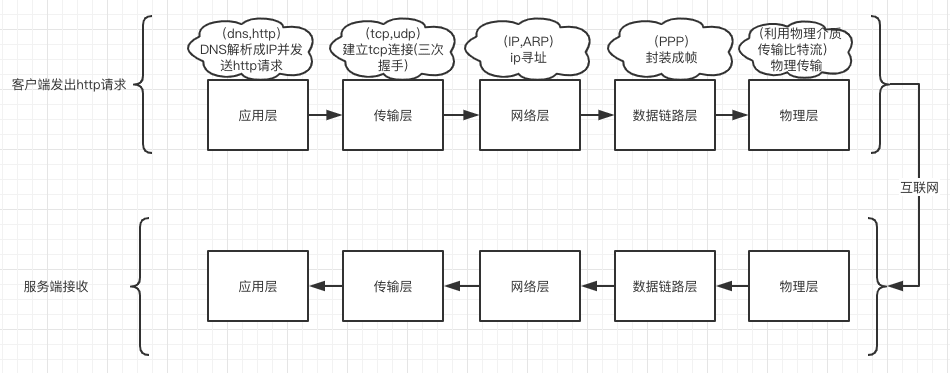
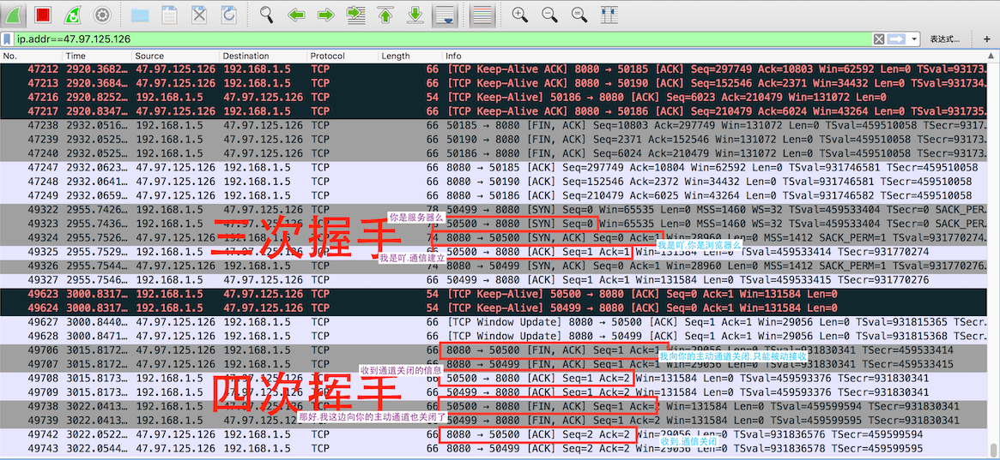
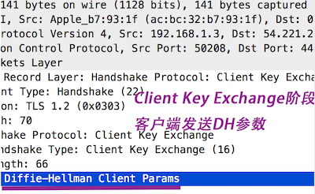

## 因特网的五层协议栈

**从客户端发出http请求到服务器接收，中间会经过一系列的流程。**
> 注：在http2推送功能之前，客户端一直是http请求的主动方



1. 应用层：构建于TCP协议之上,屏蔽网络传输细节
2. 传输层：提供可靠的端对端服务,屏蔽下层数据通信的细节
3. 网络层：为数据在结点之间传输创建逻辑链路
4. 数据链路层：在通信实体间建立数据链路连接
5. 物理层：利用物理介质传输比特流.网卡端口,网线光缆之类

> 也有一个完整的OSI七层框架：物理层、数据链路层、网络层、传输层、会话层、表示层、应用层

```md
表示层：主要处理两个通信系统中交换信息的表示方式。包括数据格式交换、数据加密与解密、数据压缩与终端类型转换等
会话层：具体管理不同用户和进程之间的对话，如控制登陆和注销过程
```

## HTTP的三次握手和四次挥手

通过协议栈了解到，TCP连接发生在`传输层`。

关于TCP connection的概念。可以理解为: http request不存在连接，只有请求和响应，那么数据包传输的连接通道就是这个TCP连接。

先来看一下三次挥手概念图


使用`Wireshark`来抓取http请求包



## HTTPS的SSL/TLS握手流程

SSL握手分为[RSA算法](http://www.ruanyifeng.com/blog/2013/06/rsa_algorithm_part_one.html)和[DH(Diffie-Hellman)算法](http://zh.wikipedia.org/wiki/迪菲－赫尔曼密钥交换)，区别会在下文注明。

先来抓一下https请求包（这是个DH算法的SSL协议的接口）：


1. 浏览器请求建立SSL链接，并向服务端发送`第一个随机数`–Client random和客户端支持的加密方法，比如RSA加密，此时是明文传输。

    
2. 服务端从中选出一组加密算法与Hash算法，回复`第二个随机数`–Server random，并将自己的身份信息以证书的形式发回给浏览器
  （证书里包含了网站地址，非对称加密的公钥，以及证书颁发机构等信息）。
    <font color=purple size=4>DH算法出于保护`第三个随机数`——`预主秘钥`的思路，将再次发送一个DH参数。</font>

    
    
3. 浏览器收到服务端的证书后
    1. 验证证书的合法性（颁发机构是否合法，证书中包含的网址是否和正在访问的一样），如果证书信任，则浏览器会显示一个小锁头，否则会有提示。
    2. 用户接收证书后（不管信不信任），浏览会生产`第三个随机数`–Premaster secret（预主秘钥），然后证书中的公钥以及指定的加密方法加密`Premaster secret`，发送给服务器。

        <font color=purple size=4>DH算法出于保护Premaster secret的思路，将发送DH参数，而不是加密的`预主秘钥`。</font>

        **那么，RSA算法过于依赖第三个随机数，理论上后者的被破防程度是由公钥的长度决定的。**

        

        **DH算法即由server发送server的DH参数和签名，client发送client的DH参数，client和server都能分别通过两个DH参数得到`Premaster secret`，以提高其安全性。**
    3. 利用Client random、Server random和Premaster secret通过一定的算法生成HTTP链接数据传输的对称加密key-`session key`。
    4. 使用约定好的HASH算法计算握手消息，并使用生成的`session key`对消息进行加密，最后将之前生成的所有信息发送给服务端。
4. 服务端收到浏览器的回复
    1. 利用已知的加解密方式与自己的私钥进行解密，获取`Premaster secret`。
    2. 和浏览器相同规则生成`session key`。
    3. 使用`session key`解密浏览器发来的握手消息，并验证Hash是否与浏览器发来的一致。
    4. 使用`session key`加密一段握手消息，发送给浏览器。
5. 浏览器解密并计算握手消息的HASH，如果与服务端发来的HASH一致，此时握手过程结束。
6. 之后所有的https通信数据将由之前浏览器生成的session key并利用对称加密算法进行加密。

## Reference

- [从输入URL到页面加载的过程？如何由一道题完善自己的前端知识体系！](https://juejin.im/post/5aa5cb846fb9a028e25d2fb1)
- [SSL/TLS协议运行机制的概述](http://www.ruanyifeng.com/blog/2014/02/ssl_tls.html)
- [图解SSL/TLS协议](http://www.ruanyifeng.com/blog/2014/09/illustration-ssl.html)