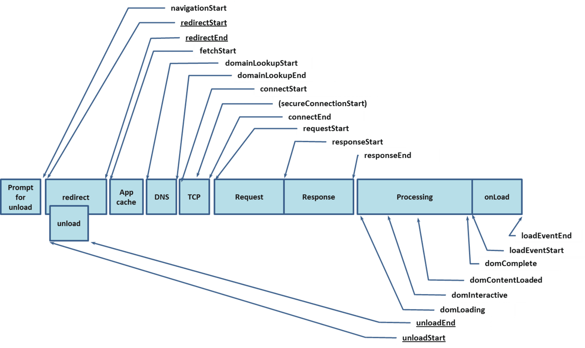
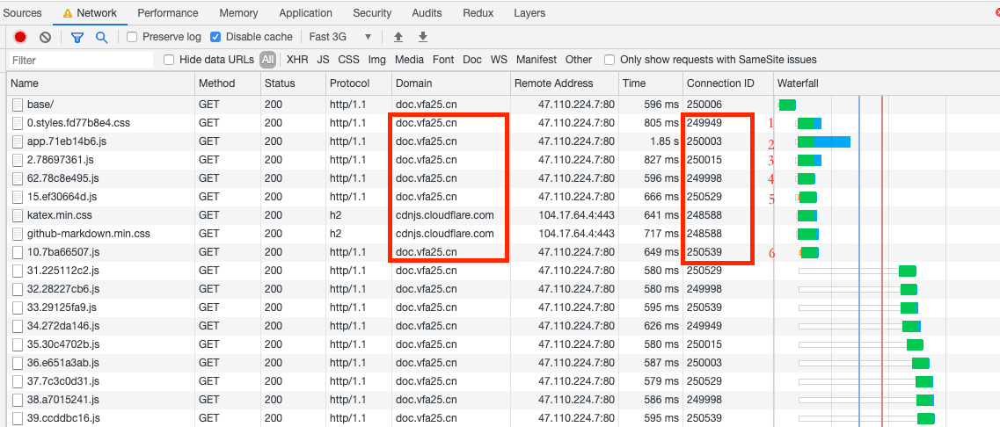
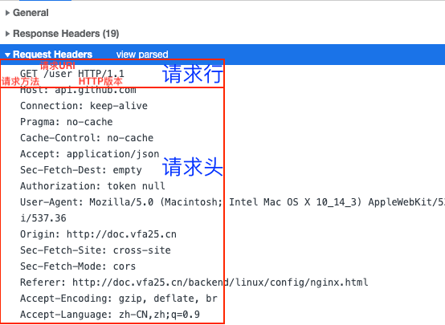
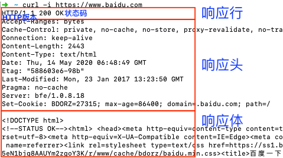
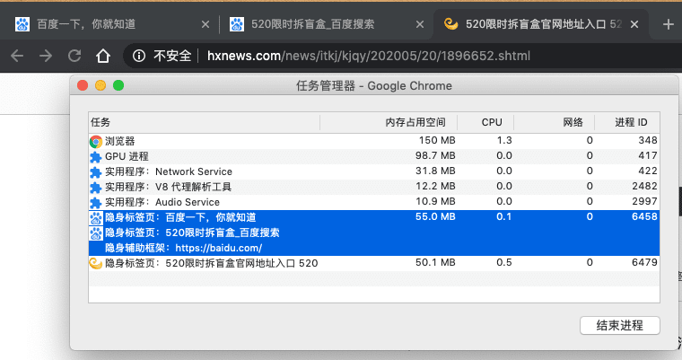

地址栏输入地址回车后，浏览器做了什么？（本章仅关注前端向，[本题的原始出处指路☞](http://fex.baidu.com/blog/2014/05/what-happen/)）

> 注：图示，`关键事件节点`可通过`window.performance.timing`API查看或打开控制台`Performance -> Event Log`更具象。


1. 解析地址栏
    - <font color=red>Browser浏览器进程（主控进程）</font>处理用户输入，开始解析URL，组装协议。
    - 在导航开始之前，可以通过[`beforeunload`](https://developer.mozilla.org/zh-CN/docs/Web/Events/beforeunload)事件取消导航，让浏览器不再执行任何后续工作。

    
    - **导航（即用户发出URL请求到页面开始解析的整个过程）** 开始（`navigationStart`）；
    

        - 在表现上，标签页的图标便进入了Loading状态。
        - 页面显示依然是之前打开的页面内容，因为要到`提交文档`阶段，<font color=red>Browser进程</font>才会移除旧的页面内容。
    - <font color=red>Browser进程</font>随即通过IPC（Inter-Process Communication）将该URL发给<font color=red>NetWork网络进程</font>；
    - `Redirect`跳转节点（`redirectStart`、`redirectEnd`），即若资源被`301永久性转移`、`302暂时性转移`（***注意，这个时间节点应是被重定向后的第二次发起URL请求时候，在下文详述***）。
2. 查找缓存（App cache）

    - 在真正发起网络请求之前，<font color=red>NetWork进程</font>会查找[浏览器缓存（本站跳转）](../internet/http-cache.html#http缓存)是否缓存了该资源。如果有缓存资源，那么直接返回资源给<font color=red>Browser进程</font>。
    - 若缓存中没有找到资源，那么直接进入网络请求流程（`fetchStart`）。
3. DNS查询得到IP

    通过`DNS（Domain Name System，域名系统）查询`，开始将目标域名解析为IP地址（`domainLookupStart`、`domainLookupEnd`）。
    - 优先命中浏览器memory cache，否则使用本机缓存，再没有的话使用hosts（/private/etc/hosts）
    - 如果本地没有，就向DNS域名服务器查询，查询到对应的IP

    参考[DNS递归查询与迭代查询](https://www.cnblogs.com/qingdaofu/p/7399670.html)
4. TCP/IP请求
    1. 等待TCP队列

    对同一个域名的请求，Chrome默认最多同时建立6个TCP连接。如果超过，多出的请求会进入队列；否则，会直接建立TCP连接。
    
    2. 建立TCP连接

    [数据传输流程（本站跳转）](../internet/internet-protocol.html#数据传输流程)（`connectStart`、`connectEnd`）。
5. 构建及发送HTTP请求

    一旦建立了TCP连接，浏览器就可以和服务器进行通信了。而HTTP中的数据正是在这个通信过程中传输的（`requestStart`）。
    - 首先，浏览器构建请求行信息（请求方法、请求地址和协议版本，以CRLF结尾），构建好后，浏览器准备发起网络请求。

    ```md
    GET /index.html HTTP1.1
    ```

    - 在浏览器发送请求行命令之后，还要以请求头（另如POST、还有请求体）形式发送一些其他信息。
    
    - get和post的区别

        get和post虽然本质都是tcp/ip，但两者除了在http层面外，在tcp/ip层面也有区别。

        get会产生一个tcp数据包，post两个

        具体就是：

        - get请求时，浏览器会把headers和data一起发送出去，服务器响应200（返回数据）。
        - post请求时，浏览器先发送headers，服务器响应100 continue，浏览器再发送data，服务器响应200（返回数据）。

        这里的区别是specification（规范）层面，而不是implementation（对规范的实现）。参考[rfc2616第8.2.3部分](https://tools.ietf.org/html/rfc2616#section-8.2.3)

6. 处理HTTP相应

    

    - 首先服务器会返回响应行，而发送完响应头后，服务器就可以继续发送响应体的数据了。
    - **响应头数据解析**： <font color=red>NetWork进程</font>解析响应头数据。
        1. **重定向状态码**

            状态码：301（永久性转移）或302（暂时性转移），<font color=red>NetWork进程</font>从响应头的`Location`字段里的地址，然后再发起新网络请求，一切又从头开始了。
        2. **响应数据类型处理**

            <font color=red>NetWork进程</font>将解析完毕的响应头信息发给<font color=red>Browser进程</font>，后者通过`Content-Type`字段确认响应体数据类型。
            - 若值为`application/octet-stream`字节流，该请求会被提交给浏览器的下载管理器，同时该URL请求的导航流程结束。
            - 若值为解析类型（如`text/html`、`text/plain`），<font color=red>Browser进程</font>随后向<font color=red>Render渲染进程</font>发起`提交导航（CommitNavigation，或称：提交文档）`的消息（示意后者准备接收响应体数据）。
    - **响应体数据解析**
        1. 准备渲染进程

            

            渲染进程策略：`process-per-site-instance`
            - 通常情况下，打开新的页面都会使用单独的渲染进程；
            - 但如果从A页面打开B页面，且A和B都属于**同一站点（same-site，相同的协议名和根域名）**，那么B页面会复用A页面的渲染进程。
        2. 提交文档

            即<font color=red>Browser进程</font>将<font color=red>NetWork进程</font>接收到的`响应体数据`提交给<font color=red>Render进程</font>，流程如下：
            - <font color=red>Render进程</font>收到`CommitNavigation`后，直接和<font color=red>NetWork进程</font>建立传输数据的`管道`；
            - 等文档数据传输完成后， <font color=red>Render进程</font>返回`确认提交文档`的消息给<font color=red>Browser进程</font>；
            - <font color=red>Browser进程</font>在收到`确认提交文档`的消息后，会移除之前的旧的文档、更新浏览器界面状态，包括：安全状态、地址栏URL、前进后退的历史状态，并置空Web页面。

            

        **至此，导航结束，其涵盖了从用户发起URL请求到提交文档给渲染进程的中间所有阶段。**

7. 页面渲染

    <font color=red>Render进程</font>通过和<font color=red>NetWork进程</font>的数据通道，开始进行页面解析和子资源的加载，并在`window.loading`事件后，通知<font color=red>Browser进程</font>页面加载完成，后者接收到消息后，会停止标签图标上的loading动画。
