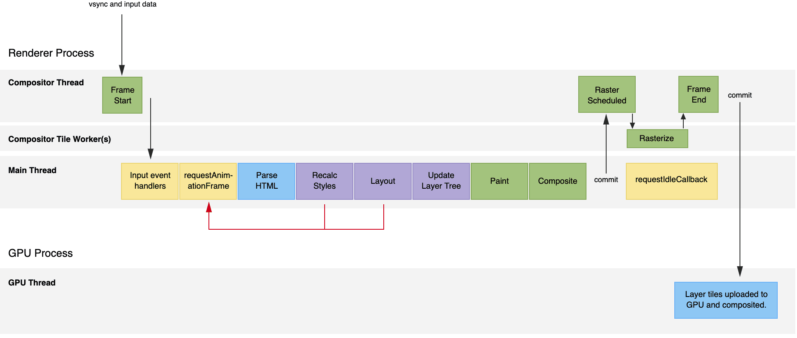
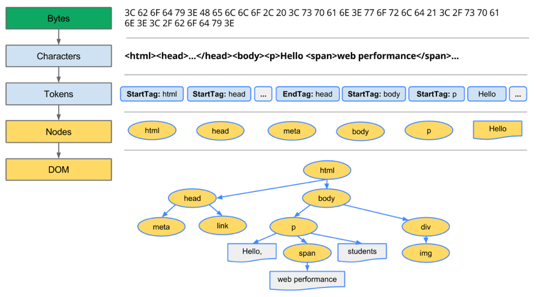
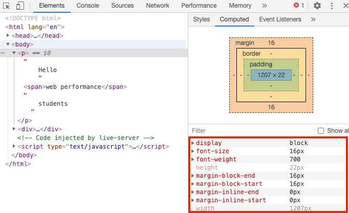
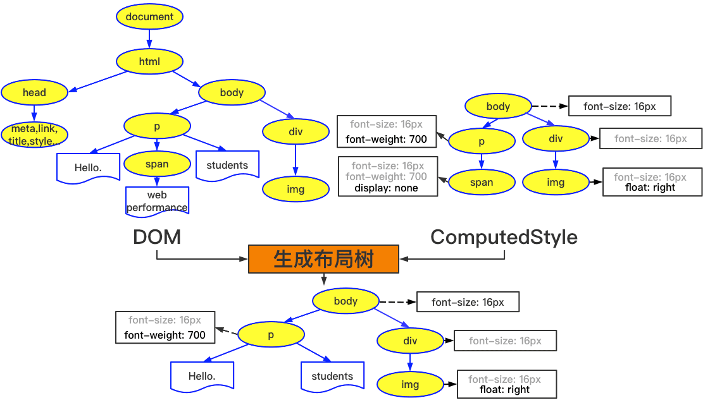
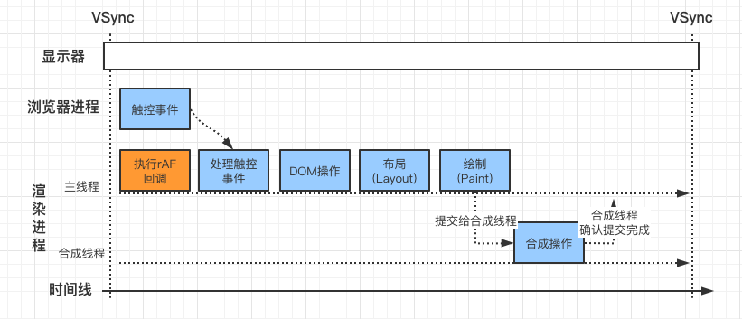

## 浏览器内核渲染引擎简介

- 浏览器内核可以分成两部分：渲染引擎（`Layout Engine`或者`Rendering Engine`）和`JS引擎`；随着`JS引擎`越来越独立，`内核`也成了`渲染引擎`的代称。
- 渲染引擎包括：HTML解释器、CSS解释器、布局、网络、存储、图形、音视频、图片解码器等。

- 现代浏览器内核一般是这四种：Trident（IE）、Gecko（火狐）、Blink（Chrome、Opera）、Webkit（Safari）。
- Chrome内核`Blink`是基于`Webkit`衍生而来的。

## 一图胜千言



::: warning 注

该图来自于[The Anatomy of a Frame | 2016.2.15 LAST UPDATED](https://aerotwist.com/blog/the-anatomy-of-a-frame/)

对于图中最后一步的`发送帧`：Chromium新的合成器架构`OOP-D（进程外Display Compositor）`，已不再由`GPU线程`完成了，而是迁移到了`Viz`进程的`VizCompositor`线程（也就是以前的GPU进程。另外，在单进程架构下，Browser进程可以兼做Viz进程）。

> 该结论参考自[Chromium Viz 浅析 - 合成器架构篇](https://zhuanlan.zhihu.com/p/62076419)。

:::

## 参与渲染的进程与其中的线程

- **渲染进程（Renderer Process）**。一般一个标签页就是一个渲染进程，渲染进程策略请看[这里](./03navigation-process.html#响应体数据解析)。
  - **合成线程（Compositor Thread）**。这是最先被告知`垂直同步事件（vsync event，操作系统告知浏览器刷新一帧图像的信号）`的线程。它接收所有的输入事件。如果可能，合成线程会避免进入主线程，自己尝试将输入的事件（比如滚动）转换为屏幕的移动。它会更新图层的位置，并经由`GPU线程`直接向`GPU`提交帧来完成这个操作。如果输入事件需要进行处理，或者有其他的显示工作，它将无法直接完成该过程，这就需要主线程了。
  - **主线程**。在这里浏览器执行：JS、样式、布局和绘制等。
  - **合成图块栅格化线程（Compositor Tile Worker）**。由`合成线程`派生的包含一个或多个线程的线程池，用于调度栅格化任务，用以将分好的`图块（tiles）`传往`GPU线程`生成`位图`。
- **GPU进程**
  - 这是一个单一的进程，为所有标签页和浏览器周边进程服务。
  - GPU进程包含**GPU线程**（用于合成位图）、可能存在的**VizCompositor线程**（用于显式合成，因为它也可能在`浏览器进程`里）。
- **浏览器进程（Browser Process）**。主控进程，整个浏览器仅且有一个。

## 渲染过程解析

浏览器器内核拿到内容后，渲染大概可以划分成以下几个步骤：
**构建DOM树、样式计算、布局阶段、分层、绘制、分块、光栅化和合成**。

<details>
<summary>以该Demo为例</summary>

```html
<!DOCTYPE html>
<html lang="en">
<head>
  <meta charset="UTF-8">
  <meta name="viewport" content="width=device-width, initial-scale=1.0">
  <title>Document</title>
  <link rel="stylesheet" href="theme.css">
  <style>
    body { font-size: 1em }
    p { font-weight: bold }
    span { color: red }
    p span { display: none }
    img { float: right }
  </style>
</head>
<body>
  <p>
    Hello.
    <span>web performance</span>
    students
  </p>
  <div>
    
  </div>
</body>
</html>
```

</details>

### 构建DOM树

无论DOM或CSSOM，和React的Fiber一样，都是以树结构存储了`节点信息`，以之为渲染依据。另外一个重要的点是**为JS脚本暴露“访问及操作结构的接口”**；反之亦成立，JS API其实是修改的DOM或CSSOM。

渲染引擎中的`HTML解析器(HTMLParser)`，将HTML字节流转换为DOM结构的过程。

简述如下：`Bytes → characters → tokens → nodes → DOM`。



> 额外说明下Tokens阶段，HTML解析器通过维护了一个Token栈结构，通过匹配开始标签和结束标签执行进出栈操作，来计算节点之间的父子关系。
> 渲染引擎的安全检查模块`XSSAuditor`，用来检测词法安全。在分词之后，会检测这些词元模块是否安全，比如是否引用了外部脚本、是否符合CSP规范、是否存在跨站点请求等。

### 样式计算（Recalculate Style）

类似DOM数构建，`CSS解析器`也需要将CSS转换为`CSSOM`。根据CSS样式表，计算出DOM树所有节点的样式。

1. 把CSS转换为浏览器理解的结构——styleSheets

    CSS样式来源主要有三种：

    - 外链：通过`link`引用的外部CSS文件
    - 行内：元素的`style`属性内嵌的 CSS
    - 内嵌：`<style>`标签内的 CSS

    通过Chrome控制台中查看其结构：`document.styleSheets`。

    

2. 转换样式表中的属性值，使其标准化

    ```css
    body { font-size: 1em }  /* body {font-size: 16px} */
    p { font-weight: bold }  /* p {font-weight: 700} */
    span { color: red }      /* span {color: rgb(255, 0, 0)} */
    p span { display: none } /* p span {display: none} */
    img { float: right }     /* img {float: right} */
    ```

3. 计算出`DOM树`中每个节点的具体样式

    

- 样式计算阶段的目的：计算出DOM节点中每个元素的具体样式，并遵守`CSS`的**继承**和**层叠**两个规则。
- 该阶段最终输出的内容是每个DOM节点的样式，并被保存在`ComputedStyle`结构内；打开Chrome的“开发者工具”，如下图所示（图示红框中即`/html/body/p`标签的`ComputedStyle`的值）：

    

### 布局阶段（Layout）

**计算每个元素的几何坐标位置，并将这些信息保存在布局树中。**

- 从`DOM树`根节点递归调用，计算每一个元素的大小、几何位置等，给每个节点所应该出现在屏幕上的精确坐标，
这个过程即`布局`。
- Chrome在布局阶段需要完成两个任务：`创建布局树`和`布局计算`。

1. 创建布局树

    在显示之前，依据前文中的`DOM树`和`ComputedStyle`，将额外地构建一棵只包含`可见元素布局树`。

    即：深度优先遍历`DOM树`中的所有**可见节点**，并把这些节点加到布局树中。

    

2. 布局计算

    计算每个可见元素的几何信息（每个元素的位置和大小）。一般作用于整个文档，计算成本通常和DOM的大小（DOM size）成正比。

### 分层（Layers）

DOM到屏幕，从概念上讲分为：

- 获取 DOM 并将其分割为多个层；
- 将每个层独立的绘制进位图中；
- 将层作为纹理上传至 GPU；
- 合成多个层来生成最终的屏幕图像。

而分层的作用：例如当进行到下一帧的渲染时，上面的独立的图层进行了平移、缩放（CSS动画），合成线程只需处理这个独立的层的变化即可。

> 注：能直接在合成线程中处理的，是不会改变图层内容的变化。如：整个图层的几何变化、透明度变化、缩放等。比如滚动页面的时候，只是对图层做上下移动。

打开Chrome的`开发者工具`，选择`Layers`标签，就可以可视化页面的分层情况（另外`More Tools->Rendering->Layer borders`，黄色边框即是各图层信息）。


- 渲染引擎需要为特定的节点生成专用的图层，并生成一棵对应的图层树（LayerTree）。
- 并不是布局树的每个节点都包含一个图层，反而，节点往往从属于父节点的图层。
- 只有在特别声明时，渲染引擎才会为特定的节点创建新的图层（即传说中的硬件加速技术）。

**如何使布局树中的节点变成新的图层**

一般来说：拥有`层叠上下文属性`的元素会被提升为单独的一层。参见[层叠上下文（MDN）](https://developer.mozilla.org/zh-CN/docs/Web/Guide/CSS/Understanding_z_index/The_stacking_context)。

调试发现，参考链接中仅部分可以创建图层。除文档根元素（`<html>`）外，整理如下：

- 最常用的方式：`translate3d`、`translateZ`。
- `position`值为`fixed`（固定定位）或 `sticky`（粘滞定位）的元素（沾滞定位适配所有移动设备上的浏览器，但老的桌面浏览器不支持）；
- `opacity`属性/过渡动画（需要动画执行的过程中才会创建合成层，动画没有开始或结束后元素还会回到之前的状态）；
- `will-chang`属性，一般配合`opacity`与`transform`使用。

**利用分层技术优化代码**

```css
.box {
    will-change: transform, opacity;
}
```

该CSS代码即提前告知渲染引擎：box元素将要做几何变换和透明度变换操作。渲染引擎会为该元素准备独立的层，等这些变换发生时，渲染引擎会通过合成线程直接去处理变换，并不会涉及主线程，这样就提高渲染的效率。这也是CSS动画比JS定时器动画更高效的原因。

**硬件加速时请使用z-index**

> Element has a sibling with a lower z-index which has a compositing layer (in other words the it’s rendered on top of a composited layer).

意思是：<font color="#E6A23C">如果有一个元素，它的兄弟元素在复合层中渲染，且后者的z-index比较小（即前者在后者上面渲染），那么前者也会被放到复合层中。</font>

参见这个地址的分析[3D硬件加速提升动画性能 与 z-index属性](https://www.cnblogs.com/qiqi715/p/10207568.html)。

### 图层绘制（Paint）

渲染引擎会把一个图层的绘制拆分成很多小的绘制指令，然后再把这些指令按照顺序组成一个`待绘制列表`（每个元素的背景、前景、边框都需要单独的指令去绘制）。生成完`绘制列表`，绘制过程就完成了。

> 注：`绘制列表`只是用来记录`绘制顺序`和`绘制指令`的列表，而表现上的绘制操作是由渲染引擎中的`合成线程`来完成的。


在该图中，`区域1`就是`document`的绘制列表，拖动`区域2`中的进度条可以重现列表的绘制过程。

### 栅格化（raster）操作

该步骤的原因和ReactNative的[FlatList组件](https://reactnative.cn/docs/using-a-listview)相似；即并不立即渲染图层的所有部分，而是优先渲染`视口（viewport）`上可见的部分，以加速页面的显示效率。

1. 图层划分为图块

    - 当图层的`绘制列表`准备好之后，主线程会把该`绘制列表`提交（commit）给`合成线程`。
    - `合成线程`会将`图层`划分为`图块`（tile），这些图块的大小通常是`256x256`或者`512x512`。

    

    <details>
    <summary>图片的截屏代码</summary>

    ```py
    import time
    from selenium.webdriver.chrome.options import Options
    from selenium import webdriver


    class Screen:
        def __init__(self):
            options = Options()
            options.add_argument('--headless')
            options.add_argument('window-size=540x2150')
            options.binary_location = "/Users/a/Desktop/Google Chrome.app/Contents/MacOS/Google Chrome"
            chrome_driver_binary = './chromedriver'
            self.driver = webdriver.Chrome(
                executable_path=chrome_driver_binary, chrome_options=options)

        def screen(self):
            self.driver.execute_script(
                'window.location.href="https://voice.baidu.com/activity/gaokao?page=collegeExam&aid=gaokao&fr=out_pc&bksubtabindex=0";')
            time.sleep(2)
            try:
                result = self.driver.save_screenshot('sreen.png') 
                print('截图{}！！！'.format('成功' if result else '失败'))
            except BaseException as msg:
                print(msg)
            self.driver.quit()


    if __name__ == '__main__':
        print(time.strftime("%Y-%m-%d %H:%M:%S", time.localtime()))
        try:
            screen = Screen()
            screen.screen()
        except BaseException as msg:
            print(msg)
    ```

    </details>

2. 图块栅格化

    **栅格化即指将图块转换为位图。`合成线程`按照视口附近的图块来优先（通过raster task）生成位图。**

    - `合成线程`通过光栅化线程池将`图层`提交给GPU进程。且`图块`是栅格化执行的最小单位。
    - `渲染进程`维护了一个栅格化的线程池，所有的`图块栅格化`都是在线程池内，按优先级执行的。
    - GPU加速
      - 通常，栅格化过程都会使用GPU（注：也可以使用CPU栅格化）来加速生成，即`快速栅格化`（或称`GPU栅格化`）。
      - 这是个跨进程通信的过程：`渲染进程`把生成位图的指令发送给`GPU进程`，在GPU中`图块`被生成为`位图`，后者保存在GPU内存中。
      - 光栅化操作执行完成后，`GPU进程`再将结果返回给`渲染进程`的`合成线程`，执行合成图层操作。
      - **纹理上传**：由于渲染进程向GPU进程的跨进程通信，从计算机内存上传到GPU内存的操作会比较慢。因此在首次显示页面内容时，先使用低质量图像作为占位，待正常分辨率的位图生成后，再替换前者。（这种逐步加载的方式也被用于前端的[图片加载优化-逐步加载](../optimize/image.html#图片加载优化-逐步加载)）

### 合成和显示

> 合成操作是在合成线程上完成的，故在执行合成操作时，不会影响到主线程执行。反之亦成立，如果主线程卡住了，但是CSS动画依然能执行。

一旦所有图块都被光栅化，`合成线程`发送`DrawQuad`命令（绘制图块的命令），然后将各图层提交给`浏览器进程`。

`浏览器进程`的`viz`组件，接收到`合成线程`的`DrawQuad`命令后，`浏览器进程`执行`显示合成`（Display Compositor，也就是将所有的图层合成为可以显示的页面图片），最后再将绘制在内存中的页面内容显示在屏幕上。

## Chromium是如何保证不掉帧或跳帧的

- 已知显示器展示图片流程

  1. 发送帧：浏览器的`浏览器进程`在显示合成图片后，会将该新生成的图片提交到`显卡`（包括GPU、显存等）的`后缓冲区`。
  2. 提交完成之后，GPU会将`后缓冲区`和`前缓冲区`互换位置；即前缓冲区变成了后缓冲区，后缓冲区变成了前缓冲区，保证了显示器每次都能读取到GPU中最新的图片。
  3. 显示器按照一定的频率（通常为60Hz，即1/60秒）来读取显卡的`前缓冲区`，并将前缓冲区中的图像显示在显示器上。

- 产生疑问
  - 若渲染进程生成的帧速率比屏幕的刷新频率慢，这就会造成`掉帧`现象，如动画卡顿；
  - 若渲染进程生成的帧速率比屏幕的刷新频率快，GPU所渲染的图像并非全都被显示出来，这就会造成`跳帧（或称丢帧）`现象；
  - 就算渲染进程生成的帧速率和屏幕的刷新频率一样，由于它们是两个不同的系统，也很难同步起来，造成不连贯现象。
- 解决之道
  - 当显示器将一帧画面绘制完成后，并在准备读取下一帧之前，显示器会发出一个 **垂直同步信号(vertical synchronization)** 给GPU，简称 VSync。
  - 具体的讲，当GPU接收到VSync信号后，会将VSync信号同步给浏览器进程，浏览器进程再将其同步到对应的渲染进程，渲染进程接收到VSync信号之后，就可以准备绘制新的一帧了。详细可参考[Improved vsync scheduling for Chrome on Android](https://docs.google.com/document/d/16822du6DLKDZ1vQVNWI3gDVYoSqCSezgEmWZ0arvkP8/edit)。



### 空闲时间

W3C关于空闲时间的介绍请看这里：[Cooperative Scheduling of Background Tasks](https://www.w3.org/TR/requestidlecallback/#idle-periods)

- What

  - 若从用户发出消息到完成合成操作花费的时间很少，少于16ms（即1/60s），那么从合成结束到下个VSync周期内，就是`空闲时间阶段`。
  - 这个阶段可以进行诸如V8的垃圾回收，或者通过[window.requestIdleCallback（MDN）](https://developer.mozilla.org/zh-CN/docs/Web/API/Window/requestIdleCallback)设置的回调任务的调用。

- How充分利用空闲回调。参考自[Background Tasks API（MDN）](https://developer.mozilla.org/zh-CN/docs/Web/API/Background_Tasks_API)
  - 对非高优先级的任务使用空闲回调。
  - 空闲回调应尽可能不超支分配到的时间。
  - 避免在空闲回调中改变DOM。空闲回调执行的时候，当前帧已经结束绘制了，所有布局的更新和计算也已经完成。如果你做的改变影响了布局，你可能会强制停止浏览器并重新计算，而从另一方面来看，这是不必要的。如果你的回调需要改变DOM，它应该使用`window.requestAnimationFrame()`来调度它，该API为`宏任务`，其回调会在**每一帧的开始执行**。
  - 避免运行时间无法预测的任务。

## 结论

回顾`渲染进程`对页面的渲染过程，对于整个流程：构建DOM树、样式计算、布局阶段、分层、绘制、分块、光栅化和合成。

其中`构建DOM树、样式计算、布局阶段、分层、绘制`是主线程完成，`分块、光栅化和合成`及`display`是非主线程完成。

- 重排：需要进行`样式计算、布局阶段、分层、绘制、分块、光栅化和合成`，性能开销最大。
- 重绘：需要进行`样式计算、绘制、分块、光栅化和合成`，因为没有引起几何位置的变换，故省去了`布局和分层`阶段，执行效率较高。
- 合成：需要进行`样式计算、分块、光栅化和合成`，例如CSS使用transform来实现动画效果，因为是在动画节点所在的独立的图层来完成动画。

## Reference

- [HTML、CSS和JavaScript，是如何变成页面的？（极客时间小册）](https://time.geekbang.org/column/article/118826)
- [[译] 浏览器帧原理剖析](https://juejin.im/post/6844903808762380296)
- [任务调度：有了setTimeOut，为什么还要使用rAF？（极客时间小册）](https://time.geekbang.org/column/article/169468)
- [Accelerated Rendering in Chrome](https://www.html5rocks.com/zh/tutorials/speed/layers/)
