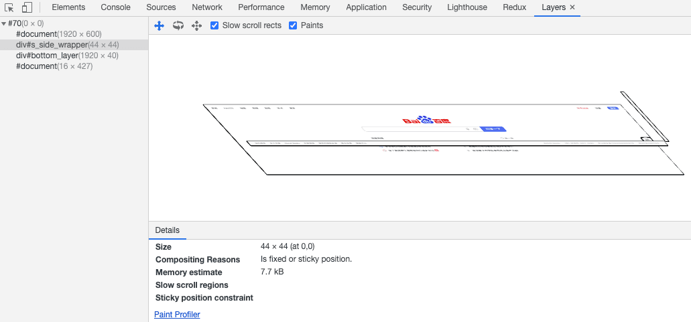
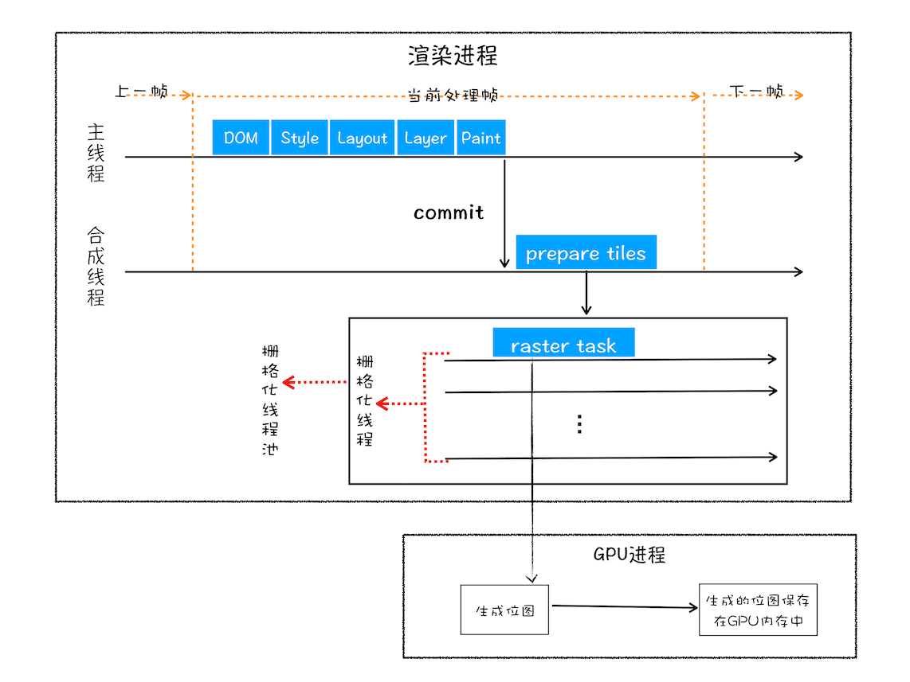

## 浏览器内核渲染引擎简介

- 浏览器内核可以分成两部分：渲染引擎（`Layout Engine`或者`Rendering Engine`）和`JS引擎`；随着`JS引擎`越来越独立，`内核`也成了`渲染引擎`的代称。
- 渲染引擎包括：HTML解释器、CSS解释器、布局、网络、存储、图形、音视频、图片解码器等。

- 现代浏览器内核一般是这四种：Trident（IE）、Gecko（火狐）、Blink（Chrome、Opera）、Webkit（Safari）。
- Chrome内核`Blink`是基于`Webkit`衍生而来的。

## 浏览器渲染过程解析

浏览器器内核拿到内容后，渲染大概可以划分成以下几个步骤：
**构建DOM树、样式计算、布局阶段、分层、绘制、分块、光栅化和合成**。

<details>
<summary>以该Demo为例</summary>

```html
<!DOCTYPE html>
<html lang="en">
<head>
  <meta charset="UTF-8">
  <meta name="viewport" content="width=device-width, initial-scale=1.0">
  <title>Document</title>
  <link rel="stylesheet" href="theme.css">
  <style>
    body { font-size: 1em }
    p { font-weight: bold }
    span { color: red }
    p span { display: none }
    img { float: right }
  </style>
</head>
<body>
  <p>
    Hello.
    <span>web performance</span>
    students
  </p>
  <div>
    
  </div>
</body>
</html>
```

</details>

### 构建DOM树

**渲染引擎解析HTML页面内容，到构建出DOM树过程。**

简述如下：`Bytes → characters → tokens → nodes → DOM`。


### 样式计算（Recalculate Style）

**根据CSS样式表，计算出DOM树所有节点的样式。**

1. 把CSS转换为浏览器理解的结构——styleSheets

    CSS样式来源主要有三种：

    - 外链：通过`link`引用的外部CSS文件
    - 行内：元素的`style`属性内嵌的 CSS
    - 内嵌：`<style>`标签内的 CSS

    通过Chrome控制台中查看其结构：`document.styleSheets`。

    

2. 转换样式表中的属性值，使其标准化

    ```css
    body { font-size: 1em }  /* body {font-size: 16px} */
    p { font-weight: bold }  /* p {font-weight: 700} */
    span { color: red }      /* span {color: rgb(255, 0, 0)} */
    p span { display: none } /* p span {display: none} */
    img { float: right }     /* img {float: right} */
    ```

3. 计算出`DOM树`中每个节点的具体样式

    

- 样式计算阶段的目的：计算出DOM节点中每个元素的具体样式，并遵守`CSS`的**继承**和**层叠**两个规则。
- 该阶段最终输出的内容是每个DOM节点的样式，并被保存在`ComputedStyle`结构内；打开Chrome的“开发者工具”，如下图所示（图示红框中即`/html/body/p`标签的`ComputedStyle`的值）：

    

### 布局阶段（Layout）

**计算每个元素的几何坐标位置，并将这些信息保存在布局树中。**

- 从`DOM树`根节点递归调用，计算每一个元素的大小、几何位置等，给每个节点所应该出现在屏幕上的精确坐标，
这个过程即`布局`。
- Chrome在布局阶段需要完成两个任务：`创建布局树`和`布局计算`。

1. 创建布局树

    在显示之前，依据前文中的`DOM树`和`ComputedStyle`，将额外地构建一棵只包含`可见元素布局树`。

    即：**深度优先遍历`DOM树`中的所有可见节点，并把这些节点加到布局树中**。

    

2. 布局计算

### 分层（Layers）

DOM到屏幕，从概念上讲分为：

- 获取 DOM 并将其分割为多个层
- 将每个层独立的绘制进位图中
- 将层作为纹理上传至 GPU
- 复合多个层来生成最终的屏幕图像。

打开Chrome的`开发者工具`，选择`Layers`标签，就可以可视化页面的分层情况（另外`More Tools->Rendering->Layer borders`，黄色边框即是各图层信息）。



- 渲染引擎需要为特定的节点生成专用的图层，并生成一棵对应的图层树（LayerTree）。
- 并不是布局树的每个节点都包含一个图层，反而，节点往往从属于父节点的图层。
- 只有在特别声明时，渲染引擎才会为特定的节点创建新的图层（即传说中的硬件加速技术）。

**如何使布局树中的节点变成新的图层**

一般来说：拥有`层叠上下文属性`的元素会被提升为单独的一层。参见[层叠上下文（MDN）](https://developer.mozilla.org/zh-CN/docs/Web/Guide/CSS/Understanding_z_index/The_stacking_context)。

调试发现，参考链接中仅部分可以创建图层。除文档根元素（`<html>`）外，整理如下：

- 最常用的方式：`translate3d`、`translateZ`。
- `position`值为`fixed`（固定定位）或 `sticky`（粘滞定位）的元素（沾滞定位适配所有移动设备上的浏览器，但老的桌面浏览器不支持）；
- `opacity`属性/过渡动画（需要动画执行的过程中才会创建合成层，动画没有开始或结束后元素还会回到之前的状态）；
- `will-chang`属性，一般配合`opacity`与`transform`使用。

**硬件加速时请使用z-index**

> Element has a sibling with a lower z-index which has a compositing layer (in other words the it’s rendered on top of a composited layer).

大概意思是：<font color="#E6A23C">如果有一个元素，它的兄弟元素在复合层中渲染，且后者的z-index比较小（即前者在后者上面渲染），那么前者也会被放到复合层中。</font>

参见这个地址的分析[3D硬件加速提升动画性能 与 z-index属性](https://www.cnblogs.com/qiqi715/p/10207568.html)。

### 图层绘制（Paint）

渲染引擎会把一个图层的绘制拆分成很多小的绘制指令，然后再把这些指令按照顺序组成一个`待绘制列表`（每个元素的背景、前景、边框都需要单独的指令去绘制）。


在该图中，`区域1`就是`document`的绘制列表，拖动`区域2`中的进度条可以重现列表的绘制过程。

`绘制列表`只是用来记录`绘制顺序`和`绘制指令`的列表，而实际上绘制操作是由渲染引擎中的`合成线程`来完成的。

### 栅格化（raster）操作

下面开始执行图层合成（Layer Compositor）。

1. 图层划分为图块

    - 该步骤的原因和ReactNative的[FlatList组件](https://reactnative.cn/docs/using-a-listview)相似；即并不立即渲染图层的所有部分，而是优先渲染`视口（viewport）`上可见的部分。
    - 当图层的`绘制列表`准备好之后，主线程会把该`绘制列表`提交（commit）给`合成线程`。
    - `合成线程`会将`图层`划分为`图块`（tile），这些图块的大小通常是`256x256`或者`512x512`。

    

    <details>
    <summary>图片的截屏代码</summary>

    ```py
    import time
    from selenium.webdriver.chrome.options import Options
    from selenium import webdriver


    class Screen:
        def __init__(self):
            options = Options()
            options.add_argument('--headless')
            options.add_argument('window-size=540x2150')
            options.binary_location = "/Users/a/Desktop/Google Chrome.app/Contents/MacOS/Google Chrome"
            chrome_driver_binary = './chromedriver'
            self.driver = webdriver.Chrome(
                executable_path=chrome_driver_binary, chrome_options=options)

        def screen(self):
            self.driver.execute_script(
                'window.location.href="https://voice.baidu.com/activity/gaokao?page=collegeExam&aid=gaokao&fr=out_pc&bksubtabindex=0";')
            time.sleep(2)
            try:
                result = self.driver.save_screenshot('sreen.png') 
                print('截图{}！！！'.format('成功' if result else '失败'))
            except BaseException as msg:
                print(msg)
            self.driver.quit()


    if __name__ == '__main__':
        print(time.strftime("%Y-%m-%d %H:%M:%S", time.localtime()))
        try:
            screen = Screen()
            screen.screen()
        except BaseException as msg:
            print(msg)
    ```

    </details>

2. 图块栅格化

    

    **栅格化即指将图块转换为位图。`合成线程`按照视口附近的图块来优先（通过raster task）生成位图。**

    - `合成线程`通过光栅化线程池将`图层`提交给GPU进程。且`图块`是栅格化执行的最小单位。
    - `渲染进程`维护了一个栅格化的线程池，所有的`图块栅格化`都是在线程池内执行的.
    - GPU加速
      - 通常，栅格化过程都会使用GPU来加速生成，这个方式叫`快速栅格化`，或者`GPU栅格化`。
      - 这是个跨进程通信的过程：`渲染进程`把生成位图的指令发送给`GPU进程`，在GPU中`图块`被生成为`位图`，后者保存在GPU内存中。
      - 光栅化操作执行完成后，`GPU进程`再将结果返回给`渲染进程`的`合成线程`，执行合成图层操作。

### 合成和显示

一旦所有图块都被光栅化，`合成线程`发送绘制图块命令`DrawQuad`，然后将各图层提交给`浏览器进程`。

`浏览器进程`的`viz`组件，接收到`合成线程`的`DrawQuad`命令后，`浏览器进程`执行`显示合成`（Display Compositor，也就是将所有的图层合成为可以显示的页面图片），最后再将绘制在内存中的页面内容显示在屏幕上。

## 结论

回顾`渲染进程`对页面的渲染过程，对于整个流程：构建DOM树、样式计算、布局阶段、分层、绘制、分块、光栅化和合成。

其中`构建DOM树、样式计算、布局阶段、分层、绘制`是主线程完成，`分块、光栅化和合成`及`display`是非主线程完成。

- 重排：需要进行`样式计算、布局阶段、分层、绘制、分块、光栅化和合成`，性能开销最大。
- 重绘：需要进行`样式计算、绘制、分块、光栅化和合成`，因为没有引起几何位置的变换，故省去了`布局和分层`阶段，执行效率较高。
- 合成：需要进行`样式计算、分块、光栅化和合成`，例如CSS使用transform来实现动画效果，因为是在动画节点所在的独立的图层来完成动画。

## Reference

- [HTML、CSS和JavaScript，是如何变成页面的？（极客时间小册）](https://time.geekbang.org/column/article/118826)
- [Accelerated Rendering in Chrome](https://www.html5rocks.com/zh/tutorials/speed/layers/)