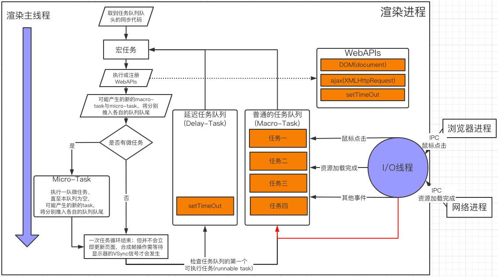
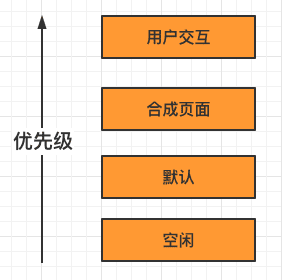
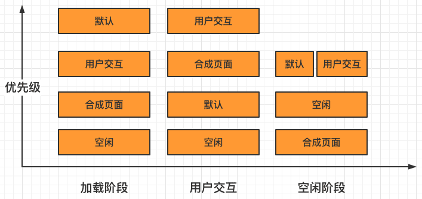

**浏览器页面是由任务队列和事件循环系统来驱动的。**

## 事件循环和任务队列



- 背景：为了能在主线程执行过程中，接收并处理其他线程发送过来新的任务。`渲染进程`中所有运行在`主线程`上的任务都需要先添加到`任务队列`，然后`事件循环系统`再按照顺序执行任务队列中的任务。
- 成员
  - 渲染主线程
  - IO线程
  - 任务队列
    - 功能：用于存放要执行的任务。
    - 特性：
      - 任务队列是`set`而不是`queues`，因为事件循环处理模型的第一步从选定的队列中获取第一个可运行任务，而不是使第一个任务出队。
      - 一个事件循环有一个或多个任务队列。一个任务队列是一组的任务。
      - `微任务队列(microtask queue)`不是一个`任务队列(task queue)`。
- 执行流程
  - 如果其他进程向`渲染主线程`跨进程通信，则需先通过IPC把任务发送给渲染进程的`IO线程`；
  - `IO线程`接收到任务之后，会将这些任务组装成任务添加进`任务队列`尾部（比如`ReactNative`的API[Callback](https://reactnative.cn/docs/native-modules-android#%E5%9B%9E%E8%B0%83%E5%87%BD%E6%95%B0)必然是异步的，因为跨进程通信就是通过事件循环来进行的）；
  - `渲染主线程`会循环地从`任务队列`读取第一个可执行的任务。

[WHATWG 规范](https://html.spec.whatwg.org/multipage/webappapis.html#event-loop-processing-model)中对事件循环机制的定义：

1. 先从多个任务队列中选出一个最老的可执行任务（即`oldestTask`），并将后者从前者中删除；
2. 然后事件循环系统将这个`oldestTask`设置为`当前正在执行的任务(currently running task)`；
3. 并记录任务开始执行的时间`taskStartTime`；
4. 执行`oldestTask`任务；
5. 执行完成后，事件循环系统将`当前正在执行的任务`设置为`null`；
6. 执行微任务队列(`MicroTasks`)；
7. 最后统计执行完成的时长等信息；
8. 循环上述过程

> 注：事件循环与更新渲染没有本质联系，后者是显示器的[垂直同步信号](./04render-process.html#chromium是如何保证不掉帧或跳帧的)驱动的。

### 任务队列中的任务类型

任务队列中的任务类型：

- 内部任务类型：Chromium的`task_type`请看[这里](https://cs.chromium.org/chromium/src/third_party/blink/public/platform/task_type.h)；包括如输入事件（鼠标滚动、点击、移动）、微任务、文件读写、WebSocket、JS定时器等。

  ::: details task_type.h

  ```c
  // Copyright 2017 The Chromium Authors. All rights reserved.
  // Use of this source code is governed by a BSD-style license that can be
  // found in the LICENSE file.

  #ifndef THIRD_PARTY_BLINK_PUBLIC_PLATFORM_TASK_TYPE_H_
  #define THIRD_PARTY_BLINK_PUBLIC_PLATFORM_TASK_TYPE_H_

  namespace blink {

  // A list of task sources known to Blink according to the spec.
  // This enum is used for a histogram and it should not be re-numbered.
  //
  // For the task type usage guideline, see https://bit.ly/2vMAsQ4
  //
  // When a new task type is created:
  // * use kCount value as a new value,
  // * update tools/metrics/histograms/enums.xml,
  // * update TaskTypes.md
  enum class TaskType : unsigned char {
    ///////////////////////////////////////
    // Speced tasks should use one of the following task types
    ///////////////////////////////////////

    // Speced tasks and related internal tasks should be posted to one of
    // the following task runners. These task runners may be throttled.

    // This value is used as a default value in cases where TaskType
    // isn't supported yet. Don't use outside platform/scheduler code.
    kDeprecatedNone = 0,

    // https://html.spec.whatwg.org/multipage/webappapis.html#generic-task-sources
    //
    // This task source is used for features that react to DOM manipulations, such
    // as things that happen in a non-blocking fashion when an element is inserted
    // into the document.
    kDOMManipulation = 1,
    // This task source is used for features that react to user interaction, for
    // example keyboard or mouse input. Events sent in response to user input
    // (e.g. click events) must be fired using tasks queued with the user
    // interaction task source.
    kUserInteraction = 2,
    // TODO(altimin) Fix the networking task source related namings once it is
    // clear how
    // all loading tasks are annotated.
    // This task source is used for features that trigger in response to network
    // activity.
    kNetworking = 3,
    // This is a part of Networking task source used to annotate tasks which are
    // posted from the loading stack (i.e. WebURLLoader).
    kNetworkingWithURLLoaderAnnotation = 50,
    // This task source is used for control messages between kNetworking tasks.
    kNetworkingControl = 4,
    // This task source is used to queue calls to history.back() and similar APIs.
    kHistoryTraversal = 5,

    // https://html.spec.whatwg.org/multipage/embedded-content.html#the-embed-element
    // This task source is used for the embed element setup steps.
    kEmbed = 6,

    // https://html.spec.whatwg.org/multipage/embedded-content.html#media-elements
    // This task source is used for all tasks queued in the [Media elements]
    // section and subsections of the spec unless explicitly specified otherwise.
    kMediaElementEvent = 7,

    // https://html.spec.whatwg.org/multipage/scripting.html#the-canvas-element
    // This task source is used to invoke the result callback of
    // HTMLCanvasElement.toBlob().
    kCanvasBlobSerialization = 8,

    // https://html.spec.whatwg.org/multipage/webappapis.html#event-loop-processing-model
    // This task source is used when an algorithm requires a microtask to be
    // queued.
    kMicrotask = 9,

    // https://html.spec.whatwg.org/multipage/webappapis.html#timers
    // For tasks queued by setInterval() and similar APIs. A different type is
    // used depending on whether the timeout is zero or non-zero. Tasks with
    // a zero timeout and a nesting level <= 5 will be associated with task
    // queues that are not throttlable. This complies with the spec since it
    // does not reduce the timeout to less than zero or bypass the timeout
    // extension triggered on nesting level >= 5.
    kJavascriptTimerDelayed = 10,
    kJavascriptTimerImmediate = 72,

    // https://html.spec.whatwg.org/multipage/comms.html#sse-processing-model
    // This task source is used for any tasks that are queued by EventSource
    // objects.
    kRemoteEvent = 11,

    // https://html.spec.whatwg.org/multipage/comms.html#feedback-from-the-protocol
    // The task source for all tasks queued in the [WebSocket] section of the
    // spec.
    kWebSocket = 12,

    // https://html.spec.whatwg.org/multipage/comms.html#web-messaging
    // This task source is used for the tasks in cross-document messaging.
    kPostedMessage = 13,

    // https://html.spec.whatwg.org/multipage/comms.html#message-ports
    kUnshippedPortMessage = 14,

    // https://www.w3.org/TR/FileAPI/#blobreader-task-source
    // This task source is used for all tasks queued in the FileAPI spec to read
    // byte sequences associated with Blob and File objects.
    kFileReading = 15,

    // https://www.w3.org/TR/IndexedDB/#request-api
    kDatabaseAccess = 16,

    // https://w3c.github.io/presentation-api/#common-idioms
    // This task source is used for all tasks in the Presentation API spec.
    kPresentation = 17,

    // https://www.w3.org/TR/2016/WD-generic-sensor-20160830/#sensor-task-source
    // This task source is used for all tasks in the Sensor API spec.
    kSensor = 18,

    // https://w3c.github.io/performance-timeline/#performance-timeline
    kPerformanceTimeline = 19,

    // https://www.khronos.org/registry/webgl/specs/latest/1.0/#5.15
    // This task source is used for all tasks in the WebGL spec.
    kWebGL = 20,

    // https://www.w3.org/TR/requestidlecallback/#start-an-event-loop-s-idle-period
    kIdleTask = 21,

    // Use MiscPlatformAPI for a task that is defined in the spec but is not yet
    // associated with any specific task runner in the spec. MiscPlatformAPI is
    // not encouraged for stable and matured APIs. The spec should define the task
    // runner explicitly.
    // The task runner may be throttled.
    kMiscPlatformAPI = 22,

    // Tasks used for DedicatedWorker's requestAnimationFrame.
    kWorkerAnimation = 51,

    // Obsolete.
    // kExperimentalWebSchedulingUserInteraction = 53,
    // kExperimentalWebSchedulingBestEffort = 54,

    // https://drafts.csswg.org/css-font-loading/#task-source
    kFontLoading = 56,

    // https://w3c.github.io/manifest/#dfn-application-life-cycle-task-source
    kApplicationLifeCycle = 57,

    // https://wicg.github.io/background-fetch/#infrastructure
    kBackgroundFetch = 58,

    // https://www.w3.org/TR/permissions/
    kPermission = 59,

    // https://w3c.github.io/ServiceWorker/#dfn-client-message-queue
    kServiceWorkerClientMessage = 60,

    // https://wicg.github.io/web-locks/#web-locks-tasks-source
    kWebLocks = 66,

    ///////////////////////////////////////
    // Not-speced tasks should use one of the following task types
    ///////////////////////////////////////

    // The default task type. The task may be throttled or paused.
    kInternalDefault = 23,

    // Tasks used for all tasks associated with loading page content.
    kInternalLoading = 24,

    // Tasks for tests or mock objects.
    kInternalTest = 26,

    // Tasks that are posting back the result from the WebCrypto task runner to
    // the Blink thread that initiated the call and holds the Promise. Tasks with
    // this type are posted by:
    // * //components/webcrypto
    kInternalWebCrypto = 27,

    // Tasks to execute media-related things like logging or playback. Tasks with
    // this type are mainly posted by:
    // * //content/renderer/media
    // * //media
    kInternalMedia = 29,

    // Tasks to execute things for real-time media processing like recording. If a
    // task touches MediaStreamTracks, associated sources/sinks, and Web Audio,
    // this task type should be used.
    // Tasks with this type are mainly posted by:
    // * //content/renderer/media
    // * //media
    // * blink/renderer/modules/webaudio
    // * blink/public/platform/audio
    kInternalMediaRealTime = 30,

    // Tasks related to user interaction like clicking or inputting texts.
    kInternalUserInteraction = 32,

    // Tasks related to the inspector.
    kInternalInspector = 33,

    // Obsolete.
    // kInternalWorker = 36,

    // Translation task that freezes when the frame is not visible.
    kInternalTranslation = 55,

    // Tasks used at IntersectionObserver.
    kInternalIntersectionObserver = 44,

    // Task used for ContentCapture.
    kInternalContentCapture = 61,

    // Navigation tasks and tasks which have to run in order with them, including
    // legacy IPCs and channel associated interfaces.
    // Note that the ordering between tasks related to different frames is not
    // always guaranteed - tasks belonging to different frames can be reordered
    // when one of the frames is frozen.
    // Note: all AssociatedRemotes/AssociatedReceivers should use this task type.
    kInternalNavigationAssociated = 63,

    // Tasks which should run when the frame is frozen, but otherwise should run
    // in order with other legacy IPC and channel-associated interfaces.
    // Only tasks related to unfreezing itself should run here, the majority of
    // the tasks
    // should use kInternalNavigationAssociated instead.
    kInternalNavigationAssociatedUnfreezable = 64,

    // Task used to split a script loading task for cooperative scheduling
    kInternalContinueScriptLoading = 65,

    // Experimental tasks types used for main thread scheduling postTask API
    // (https://github.com/WICG/main-thread-scheduling).
    // These task types should not be passed directly to
    // FrameScheduler::GetTaskRunner(); they are used indirectly by
    // WebSchedulingTaskQueues.
    kExperimentalWebScheduling = 67,

    // Tasks used to control frame lifecycle - they should run even when the frame
    // is frozen.
    kInternalFrameLifecycleControl = 68,

    // Tasks used for find-in-page.
    kInternalFindInPage = 70,

    // Tasks that come in on the HighPriorityLocalFrame interface.
    kInternalHighPriorityLocalFrame = 71,

    ///////////////////////////////////////
    // The following task types are only for thread-local queues.
    ///////////////////////////////////////

    // The following task types are internal-use only, escpecially for annotations
    // like UMA of per-thread task queues. Do not specify these task types when to
    // get a task queue/runner.

    kMainThreadTaskQueueV8 = 37,
    kMainThreadTaskQueueCompositor = 38,
    kMainThreadTaskQueueDefault = 39,
    kMainThreadTaskQueueInput = 40,
    kMainThreadTaskQueueIdle = 41,
    // Removed:
    // kMainThreadTaskQueueIPC = 42,
    kMainThreadTaskQueueControl = 43,
    // Removed:
    // kMainThreadTaskQueueCleanup = 52,
    kMainThreadTaskQueueMemoryPurge = 62,
    kMainThreadTaskQueueNonWaking = 69,
    kCompositorThreadTaskQueueDefault = 45,
    kCompositorThreadTaskQueueInput = 49,
    kWorkerThreadTaskQueueDefault = 46,
    kWorkerThreadTaskQueueV8 = 47,
    kWorkerThreadTaskQueueCompositor = 48,

    kCount = 73,
  };

  }  // namespace blink

  #endif  // THIRD_PARTY_BLINK_PUBLIC_PLATFORM_TASK_TYPE_H_
  ```

  :::

- 页面相关的事件；包括如JS执行、解析DOM、样式计算、布局计算、CSS动画等。

## Chromium是如何解决队头阻塞的

在最理想的情况下，希望能够快速跟踪高优先级任务。

1. 那么某个单个任务的优先级需要被定义

    以**交互阶段**为例，下面几种任务都应该视为高优先级的任务：

    - 通过鼠标触发的点击任务、滚动页面任务；
    - 通过手势触发的页面缩放任务；
    - 通过CSS、JS等操作触发的动画特效等任务。

    然而，这并不是仅一个优先队列就能够完美解决的，因为会随之带来第二个问题。

2. 不仅需要考虑以上单个任务的优先级，还需要让一些相同类型的任务保持其相对执行顺序。因此需要引入——**根据不同类型的任务创建不同优先级的消息队列**，即共存的多个消息队列。

    - **用户交互**：创建输入事件的消息队列，用来存放输入事件。
    - **合成页面**：创建合成任务的消息队列，用来存放合成事件。
    - **默认**：创建默认消息队列，用来存放如资源加载、页面解析、JS脚本执行和定时器回调等事件。
    - **空闲**：创建一个空闲消息队列，用来存放V8的垃圾自动回收、`window.requestIdleCallback`的回调任务等实时性不高的事件。

    

    但是这种静态优先级策略会带来新的问题。比如在页面加载阶段，若优先执行用户交互和合成页面，会将页面的解析速度拖慢。因此引入如下的解决之道。
3. **动态调度策略**。

    
    <center>动态调度策略</center>

## 宏任务和微任务

- 背景：为了兼顾`效率`（如监听DOM变化的一次触发异步调用）和`实时性`（如防止系统级的宏任务干扰），引入了微任务。
- 区分：通常`任务队列`中的任务称为`宏任务`，每个`宏任务`中都关联了一个`微任务队列`。

### 宏任务

任务队列中的任务称为`宏任务`。并且都是在主线程上执行的，包括：

- 页面渲染事件（如解析DOM、计算布局、绘制）；
- 用户交互事件（如鼠标点击、滚动页面、放大缩小等）；
- JS脚本执行事件；
- 网络请求完成、文件读写完成等各种I/O的完成事件。

### 微任务

微任务就是一个需要异步执行的函数。执行时机是在主函数执行结束之后、当前宏任务结束之前。

在创建全局执行上下文的同时，V8引擎也会在内部创建一个**微任务队列**。即每个宏任务都会创建自己的微任务队列。

- 微任务产生的时机

  产生微任务主要有两种方式。

  1. 使用`MutationObserver`监听DOM节点的变化；
  2. 使用`Promise`，且当转为固定态（resolve或reject）。

- 执行微任务队列的时机

  在JS引擎准备退出全局执行上下文并清空调用栈的时候，会检查全局执行上下文中的微任务队列、该时间点即**检查点(a microtask checkpoint)**，然后按照顺序执行队列中的微任务。
  
  如果在执行微任务的过程中，产生了新的微任务，同样会将该微任务添加到微任务队列中，直到后者为空。此时，当前宏任务才算执行结束。

## Reference

- [消息队列和事件循环：页面是怎么“活”起来的？（极客时间小册）](https://time.geekbang.org/column/article/132931)
- [Chromium 是如何解决队头阻塞问题的？（极客时间小册）](https://time.geekbang.org/column/article/169468)
- [WHATWG 规范：event-loop-processing-model](https://html.spec.whatwg.org/multipage/webappapis.html#event-loop-processing-model)
- [Cooperative Scheduling of Background Tasks（W3C）](https://www.w3.org/TR/requestidlecallback/#idle-periods)
- [从浏览器多进程到JS单线程，JS运行机制最全面的一次梳理](https://segmentfault.com/a/1190000012925872)
