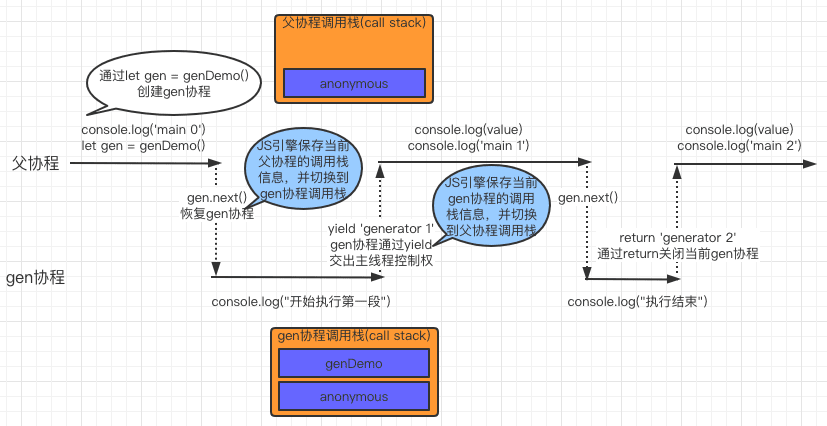

## 协程(coroutine)

已知`async/await`就是`生成器(Generator)`的语法糖，而后者的实现，则是异步编程中的`协程`模式。指路👉[阮一峰：Generator函数的异步应用](https://es6.ruanyifeng.com/#docs/generator-async)。

- 协程是什么？以该代码为例

  ```js
  function* genDemo() {
      console.log("开始执行第一段")
      yield 'generator 1'
      console.log("执行结束")
      return 'generator 2'
  }
  console.log('main 0')
  let gen = genDemo()
  console.log(gen.next().value)
  console.log('main 1')
  console.log(gen.next().value)
  console.log('main 2')
  // main 0
  // 开始执行第一段
  // generator 1
  // main 1
  // 执行结束
  // generator 2
  // main 2
  ```

  

  1. 通过调用生成器函数genDemo来创建一个协程gen，创建之后，gen协程并没有立即执行。
  2. 要让gen协程执行，需要通过调用gen.next。
  3. 当gen协程正在执行的时候，可以通过yield关键字来暂停gen协程的执行，并返回主要信息给父协程。
  4. 如果协程在执行期间，遇到了return关键字，那么会结束当前协程，并将return后面的内容返回给父协程。

- 由于React源码中的`Fiber(纤程)`概念。参考了知乎的一篇文章[协程和纤程的区别？](https://www.zhihu.com/question/23955356)，或认为差别是每个`Fiber(纤程)`拥有自己的完整stack，而协程是共用线程的stack。
- 那么，协程共用线程的调用栈应该怎么理解呢？
  - 当在gen协程中调用了yield方法时，JS引擎会保存gen协程当前的调用栈信息，并恢复父协程的调用栈信息。
  - 同样，当在父协程中执行gen.next时，JS引擎会保存父协程的调用栈信息，并恢复gen协程的调用栈信息。
