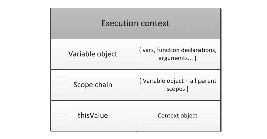
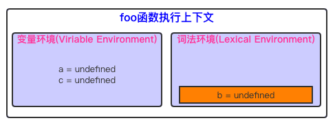
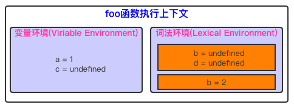
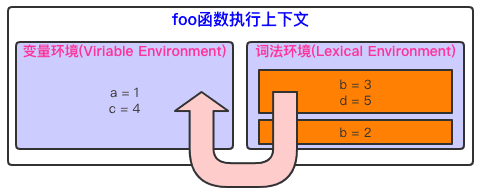

## 创建执行上下文

### 分号补全(Semicolon Insertion)

类似Java，JS执行也是需要分号的，没有的会按照一定的规则，在适当位置补充分号。

- 当有换行符（包括含有换行符的多行注释），并且下一个token没法跟前面的语法匹配时，会自动补分号。
- 当有`}`时，如果缺少分号，会补分号。
- 程序源代码结束时，如果缺少分号，会补分号。

```js
function b() {
  return
  {
      a: 'a'
  };
}
// 这个函数执行会返回undefined，原因就是分号补全机制，它变成了
function b() {
  return;
  {
      a: 'a'
  };
}
```

### 变量提升(Hoisting)

JS引擎在处理一个声明时，通常是分为三个阶段：创建（alloc）、初始化（init）、赋值。

而变量提升，只是JS引擎处理事情的方式，因为JS在执行之前需要先编译。
在执行上下文中，有一个变量环境对象（Viriable Environment Object，下文简称为VO）来存储这些声明。

```js
activeExecutionContext = {
  VO: {
    // 上下文数据（var, FD, function arguments)
  }
};
```

- 对于变量声明“myName”，将在VO里`创建`该属性，并使用`undefined`对其`初始化`；
- 对于函数声明“showName”，会将其存储到堆(HEAP)中，并在VO里`创建`该属性，然后将该属性值指向堆中函数的位置，一步完成`初始化`和`赋值`。

```md
VO(globalContext) = {
  myName: undefined
  showName: <reference to FunctionDeclaration "showName">
}
```

> 变量提升可参考[V8 是如何实现 JavaScript Hoist 的](https://blog.crimx.com/2015/03/29/javascript-hoist-under-the-hood/)。

此时，`解释器`创建好了`执行上下文`，并在`编译阶段`已有的`可执行代码（字节码）`，那么接下来就可以执行了。

## 进入执行上下文

### 执行上下文栈

`执行上下文栈(Execution Context Stack)`：在ECMASscript中的代码有三种类型：global、function和eval，它们都有各自的执行上下文（通过`console.trace();`可进行控制台打印）。

即使是同一个函数被多次调用，每次也都会创建不同的上下文。而这种一个上下文激活另一个上下文，一层层的调用下去。
这种实现方式是典型的`栈`结构，即称其为**上下文堆栈**。

激活其它上下文的某个上下文被称为**caller（调用者）**，被激活的上下文称为**callee（被调用者）**。

**过程简述：**

1. 首次载入脚本，`全局执行上下文(global execution context)`入栈，它是堆栈中最底部的元素，不可被弹出。
2. 全局程序开始初始化，生成必要的`对象(objects)`和`函数(functions)`，当然也会激活一些已初始化的方法并在初始化后，等待异步事件可能触发的方法。
3. 然后每进入后者的上下文环境，就将其压入执行栈的顶部。
4. 一旦对应的上下文执行完毕，就从栈顶弹出，并将上下文控制权交给当前的栈。
5. 这样依次执行（最终都会回到全局执行上下文）。


如果程序执行完毕后被弹出执行栈，若是没有被引用（没有形成闭包），那么这个函数中用到的内存就会被垃圾处理器自动回收。

### 执行上下文

每个`执行上下文(Execution Context)`都可以抽象为一个对象，且都有一系列的属性（即上下文状态state）主要有以下三个：
变量对象(variable object)、this指针(this value)、作用域链(scope chain)。



<font color=purple size=4>执行上下文的代码被分成两个基本的阶段来处理（无论global还是function）：</font>

1. 进入执行上下文

    当进入执行上下文（代码执行之前）时，VO里已经包含了下列属性：

    - 函数的所有形参（如果我们是在函数执行上下文中）
    - 所有函数声明(FunctionDeclaration, FD)：如果变量对象已经存在相同名称的属性，则完全**替换**这个属性
    - 所有变量声明(var, VariableDeclaration)：如果变量名称跟已经声明的形式参数或函数相同，则变量声明**不会干扰**已经存在的这类属性。

2. 执行代码

    此时，AO/VO已经拥有了属性值（或是undefined，表示仅分配了内存）。

    下例也证明了：变量是在进入上下文阶段放入VO中的。

    ```js
    if (true) {
      var a = 1;
    } else {
      var b = 2;
    }
    alert(a); // 1
    alert(b); // undefined，并非b没有声明的报错，而是b的值是undefined
    ```

### VO（变量对象）与AO（活动对象）

VO（variable object）是与执行上下文相关的`数据作用域(scope of data)`。
包括var声明（VariableDeclaration）、函数声明（FunctionDeclaration）和函数形式参数（function formal parameters）。

AO（activation object)，当函数被调用者激活，AO就被创建了，除去存储变量与函数声明之外，还包含普通参数(formal parameters)和特殊参数arguments对象。

- 在全局上下文中：VO(GlobalContextVO) === this === global（window只是浏览器环境下的其中一个属性且引用自身，还有如Math、String等）

  ```js
  global = {
    Math: <...>,
    String: <...>
    ...
    ...
    window: global //引用自身
  };
  ```

- 在函数上下文中：VO(FunctionContextVO) === AO（而且多了formal parameters和arguments）

  ```js
  AO = {
    arguments: <ArgO>
  };
  ArgO = {
    callee // 指向当前函数的引用
    length // 真正传递的参数个数
    properties-indexes // 属性为字符串类型的整数，值为函数的参数值（按参数列表从左到右排列）
  }
  ```

### 作用域链

- 作用域链(Scope Chains)
  - 定义：作用域链是一个`对象列表(list of objects)`，用以检索上下文代码中出现的`标识符(Identifiers)`，后者可以理解为变量名称、函数声明和普通参数。
  - 宏观：在ES5环境，作用域链的联动是通过`执行上下文`中的`变量环境对象`的属性`outer`，用来指向外部的上一级的执行上下文。
  - 依据：作用域链则是由词法作用域（`静态作用域[static/lexical scope]`）决定的。所谓静态作用域，是指与编译时的上下文相关，和函数如何调用无关。
  - 具体：当JS引擎执行到某函数时，会对其进行编译并创建空的函数执行上下文。同时，对其内部函数进行快速的预`词法扫描`，如果判断内部函数有对外部`标识符`的引用（即出现闭包），则在堆里创建`Closure (foo)`属性的引用（这是内部对象，JS无法访问，并仅保存被引用的外部变量）。
- `[[scope]]`属性
  - 函数上下文的作用域链在函数调用时创建，包含`活动对象`和这个函数内部的`[[scope]]`属性。

    ```js
    activeExecutionContext = {
        VO: {...}, // or AO
        this: thisValue,
        Scope: [
          // Scope chain
          // 所有变量对象的列表
          // for identifiers lookup
        ]
    };
    ```

  - 函数的作用域被定义为：`Scope = AO + [[Scope]]`
    - 出发点即是为了让函数能访问到更高一层上下文的变量对象，尽管函数自身的AO并没有该属性。
    - 同时，也说明`活动对象AO`是作用域数组的第一个对象，即添加到作用域的前端。
    - 那么，标示符解析的处理过程，本质是、用来确定`一个变量（或函数声明）`属于哪个变量对象。
  - `[[scope]]`是所有父变量对象的层级链，处于当前函数上下文之上，在函数<font color="red" size="5">创建时</font>（静态的）存于其中，直至函数销毁。

<details>
<summary>来看一下这个关于[[scope]]的例子</summary>

```js
var x = 10;
function foo() {
  var y = 20;
  function bar() {
    var z = 30;
    alert(x +  y + z);
  }
  bar();
}
foo(); // 60
```

- 全局上下文的变量对象是：

  ```js
  globalContext.VO === Global = {
    x: 10
    foo: <reference to function>
  };
  ```

- 在“foo”创建时，“foo”的`[[scope]]`属性是：

  ```js
  foo.[[Scope]] = [
    globalContext.VO
  ];
  ```

- 在“foo”激活时（进入上下文），“foo”上下文的活动对象是：

  ```js
  fooContext.AO = {
    y: 20,
    bar: <reference to function>
  };
  ```

- “foo”上下文的作用域链为：

  ```js
  fooContext.Scope = fooContext.AO + foo.[[Scope]];
  
  fooContext.Scope = [
    fooContext.AO,
    globalContext.VO
  ];
  ```

- 内部函数“bar”创建时，其`[[scope]]`为：

  ```js
  bar.[[Scope]] = [
    fooContext.AO,
    globalContext.VO
  ];
  ```

- 在“bar”激活时，“bar”上下文的活动对象为：

  ```js
  barContext.AO = {
    z: 30
  };
  ```

- “bar”上下文的作用域链为：

  ```js
  barContext.Scope = barContext.AO + bar.[[Scope]];
  
  barContext.Scope = [
    barContext.AO,
    fooContext.AO,
    globalContext.VO
  ];
  ```

- 对“x”、“y”、“z”的标识符解析如下：

  ```js
  - "x"
  -- barContext.AO // not found
  -- fooContext.AO // not found
  -- globalContext.VO // found - 10

  - "y"
  -- barContext.AO // not found
  -- fooContext.AO // found - 20

  - "z"
  -- barContext.AO // found - 30
  ```

</details>

<details>
<summary>with或catch可以改变作用域链</summary>

注意：with或catch可以改变作用域链。而这些对象都是一些简单对象，他们也会有原型链。这样的话，作用域链会从两个维度来搜寻。

1. 首先在原本的作用域链
2. 每一个链接点的作用域的链（如果这个链接点是有prototype的话）

```js
Object.prototype.x = 10;
var w = 20;
var y = 30;
console.log(x); // 10
(function foo() {
  var w = 40;
  var x = 100;
  // "x" 可以从"Object.prototype"得到，注意值是10哦。因为{z: 50}是从它那里继承的
  with ({z: 50}) {
    console.log(w, x, y , z); // 40, 10, 30, 50
  }
  // 在"with"对象从作用域链删除之后，x又可以从foo的上下文中得到了，注意这次值又回到了100哦
  console.log(x, w); // 100, 40
  console.log(window.w); // 20
})();
```

之所以要提及with，是因为Vue2.x源码的模版解析模块就是这么做的，Vue2.x渲染函数如下所示：

```js
function render () {
  with (this) {
    return _c('div',{
        on:{"click":change}
      },[
        _c('span',[_v(_s(number))]),
        _v(" "),
        _c('span',[_v(_s(name))])
      ]
    )
  }
}
```

Vue2.x中使用with关键字的片段代码如下，主要通过proxy来拦截AST语言树中涉及到的变量以及方法，并且判断是否AST语言树中是否存在为定义的变量及方法，至于为什么Vue2.x会使用with关键字。[👉Vue作者回答](https://github.com/vuejs/vue/issues/3923)，大概意思：Vue2.x并没有对模板中的JS表达式进行ast语法分析，如果要移除with，就需要对其进行ast语法分析，并且还需要一个专门的解释器对ast语法树进行解释，两个并行的解析器，维护成本高。

```js
 export function generate (
    ast: ASTElement | void,
    options: CompilerOptions
  ): CodegenResult {
    const state = new CodegenState(options)
    const code = ast ? genElement(ast, state) : '_c("div")'
    return {
      render: `with(this){return ${code}}`,
      staticRenderFns: state.staticRenderFns
    }
  }
```

</details>

### This指针

this是执行上下文环境的一个属性，而不是某个变量对象的属性。它可以称为上下文对象（context object）(激活执行上下文的上下文)。

基于这个特点：

- 和变量不同，this是`没有`一个往作用域链中，类似搜寻变量的过程。
- this不可被赋值（Python有个类似的self参数，它可以在执行过程中被改变）。
- 在global context(全局上下文)中，this的值就是指全局这个对象（在浏览器环境就是window）。
- **this是由每一次caller提供，caller是通过调用表达式（call expression）产生的（也就是这个函数如何被激活调用的）。**

```js
function foo() {
  console.log(this);
}
// caller 激活 "foo"这个callee，并且提供"this"给这个 callee
foo(); // window
foo.prototype.constructor(); // foo.prototype
var bar = {
  baz: foo
};
bar.baz(); // bar
(bar.baz)(); // bar
(bar.baz = bar.baz)(); // window
(bar.baz, bar.baz)(); // window
(false || bar.baz)(); // window
var otherFoo = bar.baz;
otherFoo(); // window
```

### （词法）闭包

- `（词法）闭包((lexical)closure)`的形态和背景
  - 函数可以作为参数被传递给其他函数使用
    这个函数被称为`funargs`(functional arguments，泛函参数)，接收`funargs`的函数被称之为`高阶函数(higher-order functions)`。
  - 其他函数的运行时会返回函数。
    这些返回的函数被称为`function valued函数`(有functional value的函数)。
  - 这两个子问题被称为`Funarg problem` (泛函参数问题)，这时需要引入闭包(closures)的概念，直观表现就是`函数的[[Scope]]属性`。

- 表象1：`向上查找的函数参数问题(upward funarg problem)`

  ***背景***：当一个函数从其他函数返回到外部的时候，这个问题将会出现。

  要能够在外部上下文结束时，进入外部上下文访问变量。`内部函数`在<font color=purple size=4>创建时(at creation moment)</font>需要将前者存储进自己的[[Scope]]属性中所对应的父级所用域。然后当这个内部函数被激活时，其上下文的作用域链表现为激活对象与[[Scope]]属性的组合。

  > 作用域链 = 活动对象 + [[Scope]]

  ***关键点***：函数在被创建时保存外部作用域，因为后者(saved scope chain)将会在未来的函数调用中用于变量查找。这种`创建时的作用域`即`静态作用域(static/lexical scope)`。

  ```js
  function foo() {
    var x = 10;
    return function bar() {
      console.log(x);
    };
  }
  var returnedFunction = foo();
  var x = 20;
  returnedFunction(); // 10
  ```

  ```js
  var obj = {
    bar: function () {
      console.log(x);
    }
  };
  function foo() {
    var x = 10;
    return obj.bar;
  }
  var returnedFunction = foo();
  var x = 20;
  returnedFunction(); // 20
  ```

- 表象2：`自上而下的高阶函数问题(downward funarg problem)`

  ***背景***：父级的上下文存在，但是在判断一个变量值的时候会有多义性（不确定是使用函数创建时的作用域，还是在执行时的作用域），为了避免多义性，可以采用闭包，也就是使用静态作用域。

  ```js
  var x = 10;
  function foo() {
    console.log(x);
  }
  (function (funArg) {
    var x = 20;
    // 这不会有歧义，因为是使用的"foo"函数[[Scope]]里保存的全局变量"x"，并不是caller作用域的"x"
    funArg(); // 结果是10而不是20
  })(foo); // 关键点：将foo作为一个"funarg"传递下去
  ```

  由此而知：使用静态作用域是闭包的一个强制性要求。

- 结论
  - **闭包是一系列代码块（在ECMAScript中是函数），并且静态保存所有父级的作用域。通过这些保存的作用域来搜寻到函数中的自由变量。**
- 注意
  - 其实每个普通函数在创建时都保存了[[Scope]]，理论上，ECMAScript中所有函数都是闭包。
  - [[Scope]]中存在的变量是指向的同一份内存。

## const和let关键字如何影响执行上下文

```js
function foo(){
    var a = 1;
    let b = 2;
    {
      let b = 3;
      var c = 4;
      let d = 5;
      console.log(a);
      console.log(b);
    }
    console.log(b);
    console.log(c);
    console.log(d);
}
foo();
```

1. 在本例中，编译并创建foo函数上下文时，通过`let`声明的变量，在编译阶段就会完成`创建`，被存放到`词法环境(Lexical Environment)`中。

    

2. 继续执行本例中的代码，当执行到代码块时，函数的执行上下文就如下图所示

    

    在`词法环境`内部，维护了一个小型`栈结构`，栈底是函数最外层的`let变量`，当进入一个`作用域块`后，会把后者内部的`let变量`压到栈顶，并在后者执行完成之后，将其信息从（词法环境结构的）栈顶弹出。

3. 对于var变量提升，如`console.log(a);`的查找顺序：则沿着词法环境的栈顶向下查询，若没有，再继续在变量环境中查找。

    

> let的暂时性死区：在块作用域内，let声明的变量仅且`创建`被提升，但`初始化`并未被提升，故无法在初始化之前使用变量。

## Reference

- [深入理解JavaScript系列（10）：JavaScript核心（晋级高手必读篇）](https://www.cnblogs.com/TomXu/archive/2012/01/12/2308594.html)
- [变量提升：JavaScript代码是按顺序执行的吗？（极客时间小册）](https://time.geekbang.org/column/article/119046)
- [从输入URL到页面加载的过程？如何由一道题完善自己的前端知识体系！](https://segmentfault.com/a/1190000013662126)
- [ECMA-262](http://dmitrysoshnikov.com/ecmascript/chapter-2-variable-object/)
- [前端性能优化原理与实践](https://juejin.im/book/5b936540f265da0a9624b04b/section/5bac3a4df265da0aa81c043c)
- [前端面试之道](https://juejin.im/book/5bdc715fe51d454e755f75ef/section/5bdc71fbf265da6128599324)
- [Vue源码阅读前必须知道javascript的基础内容](https://juejin.im/post/5b4ad441f265da0f7d4eeb7a)
- [JavaScript到底是解释型语言还是编译型语言?](https://segmentfault.com/a/1190000013126460)
