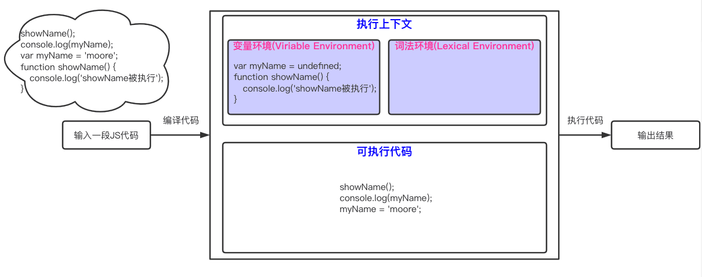

## JS是什么

对于任何计算机语言，都是`用规定的文法，去表达特定语义，最终操作运行时的`一个过程。即：

- 文法
  - 词法（直接量、关键字、运算符等）
  - 语法（它和语义一一对应，包括：表达式、语句、函数、对象、模块等）
- 语义
- 运行时
  - 类型（数据结构，包括：对象、数字、字符串，或者细分为堆、栈、链表等）
  - 执行过程（算法）

## 从V8角度看JS的生命周期

1. 生成抽象语法树和执行上下文

    高级语言是开发者理解的语言，而对于编译器或者解释器，可以理解并依赖执行的就是AST了。

    AST是什么？参考[👉javascript-ast](https://resources.jointjs.com/demos/javascript-ast)。
    1. **分词(tokenize)**
        - 读取源码，进行`词法分析(Lexical analysis)`，将其拆解成一个个`词元(atomic token)`。
        - token指的是语法上不可能再分的、最小的单个字符或字符串。

        ```js
        var a = 42;
        // 即 Keyword(var) Identifier(a) Punctuator(=) Numeric(42) Punctuator(;)
        ```

    2. **解析(parse)**
        - 对词元进行`语法分析(parsing)`，根据语法规则转为`抽象语法树(abstract syntax tree)`。
        - 然后，V8会根据AST编译生成执行上下文（注：这时只会生成全局上下文，函数或eval上下文会在调用时再编译生成）。

2. 生成字节码
    - `解释器(Ignition)`会根据AST生成`字节码(bytecode)`。
    - 字节码是介于AST和机器码之间的一种代码。但是与特定类型的机器码无关，字节码需要通过解释器将其转换为机器码后才能执行。

3. 生成机器码

    将字节码转化为CPU可以直接执行的二进制机器码。
    - 通常，`解释器(Ignition)`会 `逐条解释执行`字节码，如果发现一段代码被重复执行多次，即`热点代码(HotSpot)`（比如`for(i=0; i < 1000; i++){ sum += i; }`中的`sum += i;`语句）。那么`编译器(TurboFan)`就会`一次编译热区代码`为`机器码(Machine code)`并缓存(inline cache)，然后当再次执行这段被优化的代码时，只需要执行编译后的机器码就可以了。
    - 这种能提高运行速度，以解释器和编译器配合的方式，即`JIT即时编译(JIT-Just In Time compiler)`技术。

## 以执行上下文栈角度看JS的生命周期

已知，`活动的执行上下文组`在逻辑上组成一个堆栈。堆栈底部永远都是`全局上下文(global context)`，而顶部就是`当前（活动的）执行上下文`。堆栈在`执行上下文(Execution Context)`类型进入和退出上下文的时候被修改（推入或弹出）。



此时可以将执行上下文堆栈定义为一个数组：`ECStack = [];`。

1. 编译全局代码

    1. 创建`全局执行上下文`。
        - 在初始化（程序启动）阶段，执行上下文栈是这样的`ECStack = [globalContext];`。
        - 同时根据`变量对象(variable object)机制`，声明的函数和变量被存储在`执行上下文`的`变量环境对象(Viriable Environment Object)`中。
    2. 除声明外的其他代码将转化为字节码。
    3. 进入`全局执行上下文`，JS引擎执行代码。在执行过程中，对存储在执行上下文的变量进行赋值或函数调用。

2. 如遇函数调用代码

    1. 从`全局执行上下文`中，取出已声明过的该函数代码。
    2. 然后，对该函数体的代码进行编译，并创建该函数的执行上下文和可执行代码。此时执行上下文栈是这样的

        ```js
        ECStack = [
          <foo> functionContext
          globalContext
        ];
        ```

    3. 最后，执行函数体里的代码，输出结果。同时该函数上下文出栈`ECStack.pop();`。

<details>
<summary>3. 如遇Eval代码</summary>

eval函数的（变量或函数声明）活动时候会影响`调用上下文(calling context)`。

```js
eval('var x = 10');
(function foo() {
  eval('var y = 20');
})();
alert(x); // 10
alert(y); // VM14239:8 Uncaught ReferenceError: y is not defined
```

```js
ECStack = [
  globalContext
];

// eval('var x = 10');
ECStack.push(
  evalContext,
  callingContext: globalContext
);

// eval exited context
ECStack.pop();

// foo funciton call
ECStack.push(<foo> functionContext);

// eval('var y = 20');
ECStack.push(
  evalContext,
  callingContext: <foo> functionContext
);

// return from eval
ECStack.pop();

// return from foo
ECStack.pop();
```

</details>

## Reference

- [深入理解JavaScript系列（11）：执行上下文（Execution Contexts）](https://www.cnblogs.com/TomXu/archive/2012/01/13/2308101.html)
- [编译器和解释器：V8是如何执行一段JavaScript代码的？（极客时间小册）](https://time.geekbang.org/column/article/131887)
- [V8 是如何实现 JavaScript Hoist 的](https://blog.crimx.com/2015/03/29/javascript-hoist-under-the-hood/)
- [从输入URL到页面加载的过程？如何由一道题完善自己的前端知识体系！](https://juejin.im/post/5aa5cb846fb9a028e25d2fb1#heading-50)
- [重学前端（极客时间小册）](https://time.geekbang.org/column/article/77749)