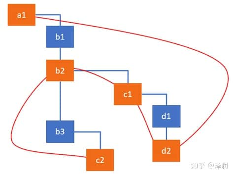

`completeWork`的工作是对已经`diff`完成后的`Fiber节点`，根据是否有`effectTag`及对应类型执行对应操作（源码请看[这里](https://github.com/facebook/react/blob/v16.13.1/packages/react-reconciler/src/ReactFiberCompleteWork.js#L636)）。

## 方法概览

`completeWork`会根据不同的`fiber.tag`调用不同的处理逻辑。

```js
function completeWork(
  current: Fiber | null,
  workInProgress: Fiber,
  renderExpirationTime: ExpirationTime,
): Fiber | null {
  const newProps = workInProgress.pendingProps;

  switch (workInProgress.tag) {
    case IndeterminateComponent:
    case LazyComponent:
    case SimpleMemoComponent:
    case FunctionComponent:
    case ForwardRef:
    case Fragment:
    case Mode:
    case Profiler:
    case ContextConsumer:
    case MemoComponent:
      return null;
    case ClassComponent: {
      // 省略
      return null;
    }
    case HostRoot: {
      // 省略
      updateHostContainer(workInProgress);
      return null;
    }
    case HostComponent: {
      // 省略
      return null;
    }
    // 省略其他类型
  }
}
```

这里重点关注下页面渲染所必须的`HostComponent`（即原生`DOM组件`对应的`Fiber节点`）。

## 以处理HostComponent为例

> 源码请看[这里](https://github.com/facebook/react/blob/v16.13.1/packages/react-reconciler/src/ReactFiberCompleteWork.js#L683)。

同样是根据`current === null ?`判断命中`mount`或是`update`逻辑。

另外，对于`HostComponent`，判断`update`时，需同时满足`workInProgress.stateNode != null ?`（即该`Fiber节点`是否存在对应的`DOM节点`）。

```js
case HostComponent: {
  popHostContext(workInProgress);
  const rootContainerInstance = getRootHostContainer();
  const type = workInProgress.type;
  if (current !== null && workInProgress.stateNode != null) {
    // update的情况
    // 省略
  } else {
    // mount的情况
    // 省略
  }
  return null;
}
```

### update时

当`update`时，`Fiber节点`已经存在对应`DOM节点`，所以需要做的主要是处理`props`，例如：

- `onClick`、`onChange`等回调函数的注册；
- 处理`style prop`；
- 处理`dangerouslySetInnerHTML prop`；
- 处理`children prop`。

> 注：处理`props`时与平台相关，请看[这里](https://github.com/facebook/react/blob/v16.13.1/packages/react-dom/src/client/ReactDOMComponent.js#L619)。

其主要逻辑是调用`updateHostComponent`函数。

```js
// update的情况
if (current !== null && workInProgress.stateNode != null) {
  updateHostComponent(
    current,
    workInProgress,
    type,
    newProps,
    rootContainerInstance,
  );
  // 省略实验性API及ref相关
}

return null;
```

在`updateHostComponent`函数（请看[这里](https://github.com/facebook/react/blob/v16.13.1/packages/react-reconciler/src/ReactFiberCompleteWork.js#L193)）内部，被处理完的`props`会被赋值给`workInProgress.updateQueue`，并最终会在`commit阶段`被渲染在页面上。

```ts
workInProgress.updateQueue = (updatePayload: any);
```

其中`updatePayload`表示`props`以数组形式：奇数索引的值为`prop key`，偶数索引的值为`prop value`。

:::details updatePayload属性Demo

```jsx
function App () {
  const [num, setNum] = useState(0);
  const increment = () => { setNum(num + 1); };
  return (
    <div>
      <button key="1" onClick={increment}>Update counter</button>
      <span key="2" className={`className-${num}`}
        style={{color: `#${num}${num}${num}`}}
      >{num}</span>
    </div>
  )
}
ReactDOM.render(<App />, document.getElementById('root'))
```

当点击按钮时，打印`console.log(workInProgress.type, updatePayload)`，如下所示：

```js
button []
span ["className", "className-1", "children", "1", "style", {color: "#111"}]
div null
```

:::

### mount时

`mount`时的主要逻辑包括：

- 为`Fiber节点`生成对应的`DOM节点`；
- 将子孙`DOM节点`插入刚生成的`DOM节点`；
- 与`update`逻辑中的`updateHostComponent`类似的处理`props`的过程。

```js
// mount的情况

// 省略服务端渲染相关
const currentHostContext = getHostContext();
// 为fiber创建对应的DOM节点
let instance = createInstance(
  type,
  newProps,
  rootContainerInstance,
  currentHostContext,
  workInProgress,
);
// 将子孙DOM节点插入刚生成的DOM节点中
appendAllChildren(instance, workInProgress, false, false);

workInProgress.stateNode = instance;

if (enableDeprecatedFlareAPI) {
  const listeners = newProps.DEPRECATED_flareListeners;
  if (listeners != null) {
    updateDeprecatedEventListeners(
      listeners,
      workInProgress,
      rootContainerInstance,
    );
  }
}

// 与update逻辑中的updateHostComponent类似的处理props的过程
if (
  finalizeInitialChildren(
    instance,
    type,
    newProps,
    rootContainerInstance,
    currentHostContext,
  )
) {
  markUpdate(workInProgress);
}
// 省略ref相关

return null;
```

:::tip
根据[beginWork一节介绍](./begin-work.html#effecttag)提出的问题：已知`mount`时，只有`rootFiber`的`子Fiber节点`（通常是`function App() {}`）存在`effectTag`（为`Placement effectTag`），那么`commit阶段`是如何通过一次插入`DOM`操作将整棵`DOM`树插入页面的？

- 原因就在于`completeWork`中的`appendAllChildren`方法。
- 由于`completeWork`属于“归”阶段调用的函数，故每次调用`appendAllChildren`时，都将会根据`fiber.child`及`fiber.sibling`，把已生成的子孙`DOM`节点插入到当前生成的`DOM`节点下。那么当“归”到`rootFiber`时，已然有了一个构建好的离屏`DOM`树。
:::

## effectList

至此`render阶段`的大部分工作就完成了。

还有一个问题：作为`DOM`操作的依据，`commit阶段`需要对所有有`effectTag`的`Fiber节点`执行`effectTag`的对应操作，那么如何进行保存这些`Fiber节点`呢？

实现方式就是借助`单向链表effectList`（注：`effectList`仅是个称呼，形容词）。




1. 在`completeWork`的上层函数`completeUnitOfWork`中，每个执行完`completeWork`且存在`effectTag`的`Fiber节点`会被保存在一个`effectList`单向链表中。
2. `effectList`保存在`父Fiber节点`（即`returnFiber`）中，`returnFiber.firstEffect`表示第一个`Fiber节点`，`returnFiber.lastEffect`表示最后一个`Fiber节点`。
3. 类似`appendAllChildren`，在“归”阶段，所有有`effectTag`的`Fiber节点`都会被追加在`effectList`中，最终形成一条以`rootFiber.firstEffect`为起点的单向链表。

```md
rootFiber.firstEffect       ...省略中间的n个fiber...      rootFiber.lastEffect
         |                                                       |
         |                                                       |
         ↓   nextEffect         nextEffect         nextEffect    ↓
       fiber-----------> fiber -----------> fiber -----------> fiber
```

这样，在`commit阶段`只需要遍历`effectList`就能执行所有`effect`了。

这段代码逻辑请看[这里](https://github.com/facebook/react/blob/v16.13.1/packages/react-reconciler/src/ReactFiberWorkLoop.js#L1538)。

借用`React`团队成员`Dan Abramov`的话：`effectList`相较于`Fiber树`，就像圣诞树上挂的那一串彩灯。

## 流程结尾

至此，`render阶段`全部工作完成。在`performSyncWorkOnRoot`函数中`fiberRootNode`被传递给`commitRoot`方法（即`commitRoot(root);`），开启`commit阶段`工作流程。

## 总结


<center>completeWork流程图（该图暂忽略Scheduler相关）</center>

## Reference

- [Fiber 内部: 深入理解 React 的新 reconciliation 算法](https://zhuanlan.zhihu.com/p/59055212)。
