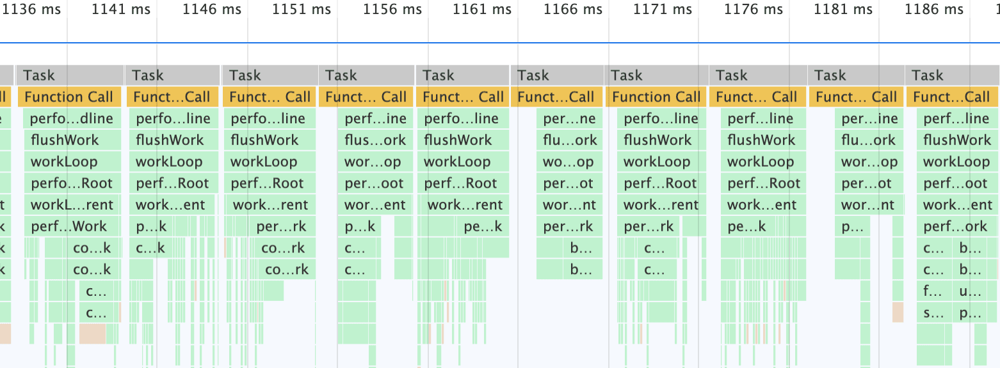

> 本系列参考自[卡颂的React技术揭秘](https://react.iamkasong.com/)，[Dan Abramov's blog](https://overreacted.io/)。基于[React v16.13.1](https://github.com/facebook/react/tree/v16.13.1)。

## React理念

如[官网](https://zh-hans.reactjs.org/docs/thinking-in-react.html)关于对`React 哲学`的介绍：

> React 是用 JavaScript 构建**快速响应**的大型 Web 应用程序的首选方式。它在 Facebook 和 Instagram 上表现优秀。

而制约`快速响应`的因素无外乎两种场景：

- CPU-bound：例如创建新的 DOM 节点和运行组件中的代码。前者的本质是`Browser进程`向`Render进程`的跨进程通信，后者可能会出现执行时间过长的任务；造成页面掉帧。
- IO-bound：例如从网络加载代码或数据。如在屏幕之间切换时，显示过多的中间加载状态会使切换的速度变慢。

> React官网对并发的解释，请看[这里](https://zh-hans.reactjs.org/docs/concurrent-mode-intro.html#concurrency)。

## CPU瓶颈

- 首先浏览器在渲染页面时有如下特性：

  1. `JS脚本的执行`（由JS引擎完成）与`页面渲染`（由Blink引擎完成，处理“DOM、Style、Layout、Layer、Paint”）互斥，因为这两项工作都是运行在`渲染主线程`，即前者的执行会造成后者挂起。请看[这一节介绍](../../base/browser/04render-process.html#一图胜千言)。
  2. 每一`帧`包含`工作阶段`和`空闲阶段`。并在该帧时间结束时，显示器会去读取显卡的`前缓冲区`，如果`工作阶段`一直被JS任务（同步或异步的单个大任务）霸占（执行时间大于1帧），轻者出现掉帧情况，重则看不到页面任何响应。请看[这一节介绍](../../base/browser/04render-process.html#chromium是如何保证不掉帧或跳帧的)。
  3. 对于`用户交互事件`，如果该事件有回调，则会经过`渲染进程`的`I/O线程->合成线程->渲染主线程`，随后该回调被推入`用户交互事件队列`（注：一个事件循环有一个或多个事件队列），从交互友好方面看希望这是高优先级执行的。请看[这一节介绍](../../base/browser/06event-loop.html#事件循环和任务队列)。

- 对于以上特性，提出问题

  1. 如何防止动画掉帧，或正在执行JS大任务造成的输入卡死？
  2. 在每次帧结束时，如何避免展示出不完全的页面？
  3. 如何保证高优先级任务的及时执行呢？

那么React是如何解决的呢？

### 可中断的异步更新

**异步更新的优点：响应自然。**

1. 针对第一个问题：**可中断的任务切片**。
    - Why
      :::tip Time Slicing
      - React doesn't block the thread while rendering
      - Feels synchronous if the device is fast
      - Feels responsive if the device is slow
      - Only the final rendered state is displayed
      - Same declarative component model
      > 参考自[Dan Abramov- Beyond React 16 - JSConf Iceland 2018](https://www.youtube.com/watch?v=v6iR3Zk4oDY)。
      :::
    - When（切片动作的时机）

      React默认的每个切片任务的执行周期为5ms（源码请看[这里](https://github.com/facebook/react/blob/v16.13.1/packages/scheduler/src/forks/SchedulerHostConfig.default.js#L119)），即每5ms会递归的触发`宏任务`，执行JS、重启React工作。

      如果`需要绘制页面`或`用户正在输入`（借助`navigator.scheduling.isInputPending`，[Example请看这里](https://github.com/WICG/is-input-pending#example)）（该逻辑源码请看[这里](https://github.com/facebook/react/blob/v16.13.1/packages/scheduler/src/forks/SchedulerHostConfig.default.js#L145)），那么React（JS）将`渲染主线程`控制权交还给浏览器，用于`渲染UI`或进入新的`事件循环`。
    - How

      开启`时间切片`的方式：入口API使用`Concurrent Mode`。

      ```js
      ReactDOM.unstable_createRoot(rootEl).render(<App/>);
      ```

      

      所以，解决CPU瓶颈的关键是实现**时间切片**，其关键是：将同步的更新变为**可中断**的异步更新。

      ::: details 同步更新 vs 异步更新 Demo
      当有个更新很耗时的大列表，来看看同步更新和异步更新时，输入框的响应速度。Demo出处React官网介绍请看[这里](https://zh-hans.reactjs.org/docs/concurrent-mode-patterns.html#deferring-a-value)。

      [同步更新](https://codesandbox.io/s/pensive-shirley-wkp46)

      [异步更新](https://codesandbox.io/s/infallible-dewdney-9fkv9)
      :::

2. 针对第二个问题：双缓存机制。React的`Scheduler`和`Reconciler`为异步，待所有组件都完成`Reconciler`的工作，才会统一交给`Renderer`。这和显卡的`前缓冲区`与`后缓冲区`的概念类似。
3. 针对第三个问题：则是通过区分优先级来实现的，各优先级请看[源码中的定义](https://github.com/facebook/react/blob/v16.13.1/packages/scheduler/src/SchedulerPriorities.js)。

## IO瓶颈

根据研究结果，帮助将人机交互研究的结果整合到真实的 UI 中。

例如，应用的两个屏幕之间导航，不再是过渡到一个空白屏或者大型的轮播图会是一个不愉快的体验，而是可以在旧屏幕上多停留一段时间，并在展示新屏幕之前“跳过”“不够好的加载状态”，不是更好吗？

> React官网对`有意的加载顺序`的解释请看[这里](https://zh-hans.reactjs.org/docs/concurrent-mode-intro.html#intentional-loading-sequences)。

为此，React实现了[Suspense](https://zh-hans.reactjs.org/docs/concurrent-mode-suspense.html)功能及配套的hook——[useDeferredValue](https://zh-hans.reactjs.org/docs/concurrent-mode-reference.html#usedeferredvalue)。

而在源码内部，为了支持这些特性，同样需要将同步的更新变为**可中断**的异步更新。
