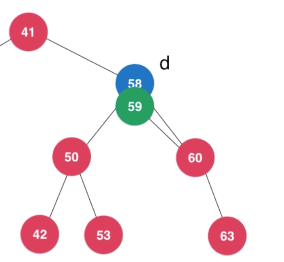

## 特点

- 二叉搜索树也是二叉树。
- 二叉搜索树的每个结点的值：大于其左子树的所有结点的值；同时小于其右子树的所有结点的值。
- 每一棵子树也是二叉搜索树。

::: warning 本篇不考虑树中存在重复元素
处理重复元素两种思路：

- 一是借助链表或动态数组，把值相同的数据存储在一个结点；
- 二是一个结点仍只存储一个数据，若在查找插入位置时，值相同，则当作大于这个结点的值来处理（即插入右子树）。
:::

## 概念

- 高度（`Height`，参考点为叶子结点）：该结点到叶子结点的最长路径（边的个数）。
- 深度（`Depth`，参考点为根结点）：根结点到该结点所经历的边的个数。
- 层（`Level`）：结点的深度 + 1。

```md
                     高度  深度  层
     6                3    0    1
   /   \
  3     8             2    1    2
 / \   / \
1   5 7   9           1    2    3
   /
  4                   0    3    4
```

## 原则（条件）

- 具有顺序性。
- 存储的元素必须有可比较性（在实际的软件开发中，在二叉查找树中存储的，是一个包含很多字段的对象。利用对象的某个字段作为键值来构建二叉查找树，而其他字段叫作卫星数据）。

## 常见操作

### 插入

[图片来源](https://mp.weixin.qq.com/s/dAmOl1i3_0uXe2cWO9jSdA)

二叉搜索树的插入操作和链表较为类似，但多了`比较`和`left/right指针选择`。

- 递归方式，结束条件为`目标位置（左子结点或右子结点）为null`，伪代码：

```js
Node add(node, e) {
  if node == null then return new Node(e)

  if e < node.e
    then node.left := add(node.left, e)
  elseif e > node.e
    then node.right := add(node.right, e)

  return node
}
```

### 搜索


和`插入操作`类似。

- 递归方式，结束条件为`匹配到结点`或`查找到null`：

  ```js
  boolean contains(node, e) {
    if node == null then return false
    if e == node.e then return true

    if e < node.e
      then return contains(node.left, e)
    elseif e > node.e
      then return contains(node.right, e)
  }
  ```

- 迭代方式：

  ```js
  boolean contains(node, e) {
    cur := node;
    while cur != null do {
      if e < cur.e then cur := cur.left;
      elseif e > cur.e then cur := cur.right;
      else return true;
    }
    return false;
  }
  ```

### 删除

- 若待删除结点仅有左子结点或右子结点，均可以以后者直接替换前者。
- 若目标同时存在左右子结点，使用`Hibbard Deletion`方法（以后继结点替换待删除结点的位置）：

  - 在待删除结点`d`的右子树中，查找后继结点`s`（与待删除结点最相近的叶子结点），即`s = min(d -> right)`。
  - 找到后继结点`s`，其将替换待删除结点`d`的位置，即`s -> right = removeMin(d -> right)`、`s -> left = d -> left`。
  - 最后删除`d`，`s`成为新的子树的根。



```js
// 返回删除结点后的新的BST的根
Node remove(node, e) {
  if node == null then return null
  if e < node.e
    then
      node.left := remove(node.left, e)
      return node
  elseif e > node. e)
    then
      node.right := remove(node.right, e)
      return node
  else
    // 确定待删除的目标结点
    // 不同时存在左右子结点
    if node.left == null
      then
        rightNode := node.right
        node.right := null
        return rightNode
    elseif node.right == null
      then
        leftNode := node.left
        node.left := null
        return leftNode
    else
      // 同时存在左右子结点
      successor := minimum(node.right)
      successor.right := removeMin(node.right)
      successor.left := node.left

      node.left := node.right := null
      return successor
}
```

### 遍历

#### 三种形式实现DFS

每一个结点，都会有三次造成访问时间点，即`node.left`，`node.right`，`node操作`。

根据`访问结点`与`对左右子树递归遍历`的`时间点`不同，有以下三种


```js
void traverse(Node node) {
  if node == null then return

  访问该结点? /*前序遍历*/
  traverse(node.left)
  访问该结点? /*中序遍历*/
  traverse(node.right)
  访问该结点? /*后序遍历*/
}
```

::: tip Demo

```md
    A
   / \
  B   C
 / \ / \
D  E F  G
```

- 前序遍历：A$\rightarrow$B$\rightarrow$D$\rightarrow$E$\rightarrow$C$\rightarrow$F$\rightarrow$G
- 中序遍历：D$\rightarrow$B$\rightarrow$E$\rightarrow$A$\rightarrow$F$\rightarrow$C$\rightarrow$G
- 后序遍历：D$\rightarrow$E$\rightarrow$B$\rightarrow$F$\rightarrow$G$\rightarrow$C$\rightarrow$A
:::

- 前序遍历
  - 最自然、常用的遍历方式。
- 中序遍历
  - 特点及应用场景：结果总是顺序（指升序或降序）的；因此，二叉搜索树也叫作二叉排序树。
- 后序遍历
  - 特点：会先处理某个结点的左子树及右子树，再处理结点本身，是一个从叶子结点开始的过程。
  - 应用场景：为二叉搜索树释放内存。

遍历通常以递归的方式实现，请看[这里（Java）](https://github.com/vfa25/dataStructure-algorithm/blob/master/datastructure/src/tree/BST.java#L77)。

#### 迭代方式实现DFS和BFS


- DFS：通过维护栈结构，以两种思路实现

  1. 第一种方式：维护一个栈结构，从上而下的遍历子树。

      ```java
      import java.util.Stack;
      public void preOrderNR() {
          Stack<Node> stack = new Stack<>();
          stack.push(root);
          while(!stack.isEmpty()) {
              Node cur = stack.pop();
              System.out.println(cur.e);

              if (cur.right != null)
                  stack.push(cur.right);
              if (cur.left != null)
                  stack.push(cur.left);
          }
      }
      ```

  2. 第二种方式：维护一个栈结构，从下而上的不断溯源可遍历的子树，一旦出现可遍历左子树的结点，即push进栈结构，等待下一次外层循环。

      ```java
      import java.util.Stack;
      public void preOrderDFS() {
          Stack<Node> stack = new Stack<>();
          Node cur = root;
          Node right = null;
          while(cur != null || !stack.isEmpty()) {
              // 一直找到当前结点最左端的叶子结点
              while (cur != null) {
                  System.out.println(cur.e);
                  stack.push(cur);
                  cur = cur.left;
              }
              cur = stack.pop();
              // while循环：从最左叶子结点溯源，找到最早出现右结点的结点。
              // 注意：向上溯源前，要记得标记一下当前结点已遍历
              // 向上溯源（返回父结点）的条件为：
              // 当前结点 cur 没有右结点、或缓存的right结点是当前的右结点（即左右子树均已遍历）
              while (cur.right == null || cur.right == right) {
                  right = cur;
                  if (stack.isEmpty()) {
                      return;
                  }
                  cur = stack.pop();
              }
              // 一旦溯源而上的、某个结点找到右叶子结点，即将后者赋值给cur
              stack.push(cur);
              cur = cur.right;
          }
      }
      ```

- BFS，即层序遍历，通过维护队列结构实现

  ```java
  import java.util.LinkedList;
  import java.util.Queue;
  public void preOrderBFS() {
      Queue<Node> queue = new LinkedList<Node>();
      queue.offer(root);
      while(!queue.isEmpty()) {
          Node cur = queue.poll();
          System.out.println(cur.e);

          if (cur.left != null)
              queue.offer(cur.left);
          if (cur.right != null)
              queue.offer(cur.right);
      }
  }
  ```

### 求floor值

二叉搜索树有顺序性，获取floor值（最接近且小于的值）也变为可能。

```js
Node floor(node, e) {
  if node == null then return null

  if e == node.e
    then return node
  elseif e < node.e
    then return floor(node.left, e)
  else
    result := floor(node.right, e)
    if result == null
      then return node
    else
      return result
}
```

## 时间复杂度分析

- 最坏情况时间复杂度：即退化成链表，为$O(n)$。
- 最好情况时间复杂度：即完全二叉树，为$O(logn)$。

  ::: tip 完全二叉树时间复杂度分析
  由于时间复杂度与树的高度成正比，即$O(height)$，那么对于结点总数`n`与层数`L`，满足：

  ```md
  n >= 1+2+4+8+...+2^(L-2)+1
  n <= 1+2+4+8+...+2^(L-2)+2^(L-1)
  ```

  根据等比数列求和得，层数`L`的区间为[$O(log_2{(n+1)})$, $O(log_2{n}+1)$]，故完全二叉树的时间复杂度为$O(logn)$。
  :::

> 为了防止二叉搜索树退化成链表，因此将引入平衡二叉搜索树。后者高度接近于$O(logn)$，所以访问、搜索、插入、删除时很稳定，时间复杂度均为$O(logn)$。
