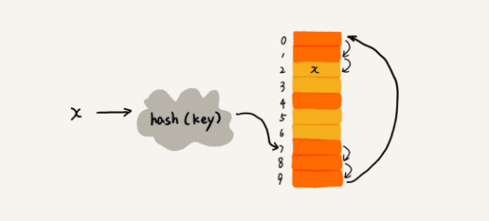
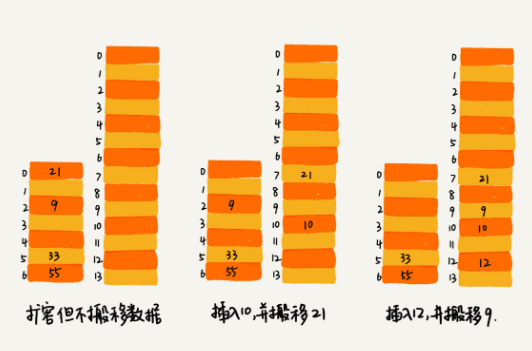

# 散列表(Hash Table)

- 特性

  **该数据结构最大优势——存读无序数据，为$O(1)$的时间复杂度。**

  散列表用的是数组支持按照下标随机访问数据的特性，所以散列表其实就是数组的一种扩展，由数组演化而来。可以说，如果没有数组，就没有散列表。

- **散列思想**
  
  用一个被称作`键`或`关键字`的编号来标识一个信息。把编号转化为数组下标的映射方法就叫作`散列函数`，而散列函数计算得到的值就叫作`散列值`。

- 实现方式

  散列表用的就是数组支持按照下标随机访问的时候，时间复杂度是$O(1)$的特性。
  通过散列函数把元素的键值映射为下标，然后将数据存储在数组中对应下标的位置。
  当按照键值查询元素时，用同样的散列函数，将键值转化数组下标，从对应的数组下标的位置取数据。

## 散列函数设计

该函数可以将其定义为`hash(key)`，其中key标识元素的键值，hash(key) 的值表示经过散列函数计算得到的散列值。

**该如何构造散列函数？**

1. 散列函数计算得到的散列值是一个非负整数；
2. 如果 key1 = key2，那 hash(key1) == hash(key2)；
3. 如果 key1 ≠ key2，那 hash(key1) ≠ hash(key2)。

第三点是理想状态，在真实的情况下，要想找到一个不同的 key 对应的散列值都不一样的散列函数，几乎是不可能的。
即便像业界著名的
[MD5](https://zh.wikipedia.org/wiki/MD5)、
[SHA](https://zh.wikipedia.org/wiki/SHA家族)、
[CRC](https://zh.wikipedia.org/wiki/循環冗餘校驗)等哈希算法，也无法避免这种**散列冲突**。
而且，因为数组的存储空间有限，也会加大散列冲突的概率。

## 散列冲突解决

首先，没有完美的无冲突的散列函数。因此，寻找解决冲突的方法是必须的。

常用的散列冲突解决方法有两类：开放寻址法（open addressing）、链表法（chaining）。

- 开放寻址法（代表：Java中的`ThreadLocalMap`即通过线性探测的开放寻址法来解决冲突）

  核心思想：如果出现了散列冲突，就重新探测一个空闲位置，将其插入。

  How？如图示，橙色表示已有数据。

  

  1. 线性探测（Linear Probing）

  `插入操作`，如果某个数据经过散列函数散列之后，存储位置已经被占用了，
  就从当前位置开始，依次往后查找（若到底则从头开始），查看是否有空闲位置，直到找到为止，执行插入操作。

  `查找操作`同理。先通过散列函数求出要查找元素的键值对应的散列值，然后比较数组中下标为散列值的元素和要查找的元素。
  如果相等，则说明就是要找的元素；否则就顺序往后依次查找。
  ***当遍历到数组中的空闲位置***，还没有找到，就说明要查找的元素并没有在散列表中。

  `删除操作`较特殊。可以将删除的元素，特殊标记为deleted（***为什么不直接置空，因为要兼顾`查找操作`的逻辑***）。当线性探测查找的时候，遇到标记为deleted的空间，并不是停下来，而是继续往下探测。
  
  ***业务痛点***：随着散列表数据增多，散列冲突发生的可能性会越来越大，空闲位置会越来越少，线性探测的时间会越来越久。最坏情况时间复杂度为$O(n)$（即探测整个数组）。

  2. 二次探测（Quadratic probing），出发点是加速空址寻找，数据位置趋于均匀分布。

  跟线性探测很像，线性探测每次探测的步长是1，即探测的下标序列为：$hash(key)+0$，$hash(key)+1$，$hash(key)+2...$

  而二次探测探测的步长就变成了原来的”二次方“，即探测的下标序列为：$hash(key)+0$，$hash(key)+1^2$，$hash(key)+2^2...$

  3. **双重散列**（Double hashing）

  不仅要使用一个散列函数。而是使用一组散列函数$hash1(key)$，$hash2(key)$，$hash3(key)...$

  先用第一个散列函数，如果计算得到的存储位置已经被占用，再用第二个散列函数，依次类推，直到找到空闲的存储位置。

  > 当散列表中空闲位置不多时，散列冲突的概率总会大大提高。
  
  为了尽可能保证散列表的操作效率，一般情况下，会尽可能保证散列表中有一定比例的空闲槽位。用**装载因子**（load factor）来表示空位的多少。

  ```md
  散列表的装载因子 = 填入表中的元素个数 / 散列表的长度
  ```

  装载因子越大，说明空闲位置越少，冲突越多，散列表的性能会下降。

- 链表法（代表：Java中的`LinkedHashMap`）

  链表法是一种更加常用且相对简单的散列冲突解决办法。

  如下图示，在散列表中，每个`桶（bucket）`或者`槽（slot）`会对应一条链表，所有散列值相同的元素都放到相同槽位对应的链表中。

  

  - 当插入元素时，通过散列函数计算出对应的散列槽位，将其插入到对应链表中即可。时间复杂度是$O(1)$。
  - 当查找或删除时，同样通过散列函数计算出对应的槽，然后遍历链表查找或者删除。时间复杂度是$O(k)$，其中k为链表的长度。

## 开放寻址法和链表法的优缺点及抉择

- 开放寻址法
  - 优点
    - 不需要拉很多链表。散列表中的数据都存储在数组中，可以有效地利用 CPU缓存 加快查询速度
      （链表中的结点非连续的分布在内存中，对CPU缓存、执行效率不友好）。
    - 序列化起来比较简单。链表法包含指针（大小为4个字节或者8个字节），序列化起来就没那么容易。而序列化，很多场合都会用到的。
  - 缺点
    - 删除操作较麻烦，需要特殊标记已经删除掉的数据。
    - 理论上内存占用更大。所有的数据都存储在一个数组中，比起链表法来说，冲突的代价更高。
      那么，装载因子的上限不应太大。这也导致该方法比链表法更浪费内存空间。
  - 总结：**当数据量比较小、装载因子小的时候，适合采用开放寻址法。这也是 Java 中的ThreadLocalMap使用开放寻址法解决散列冲突的原因。**
- 链表法
  - 优点
    - 内存利用率较高。即链表结点可以在需要的时候再创建，并不需要像开放寻址法那样事先申请好。
    - 对大装载因子的容忍度更高（敏感度更低）。只要散列函数的值随机均匀，即便装载因子变成10，
      也只是链表长度变长了而已，相比顺序查找还是要快很多。
  - 缺点亦可化优点
    - 对链表法稍加改造即可以实现更加高效的散列表。那就是——将链表法中的链表改造为其他高效的动态数据结构，比如跳表、红黑树。
      极端情况也能保底为$O(logn)$的时间复杂度。可有效避免散列碰撞攻击。
  - 总结：**基于链表的散列冲突处理方法比较适合存储大对象、大数据量的散列表。而且，比起开放寻址法，它更加灵活，支持更多的优化策略，比如用红黑树代替链表。**

## 应用场景

- Word文档中单词拼写检查

  将常用的20万个单词存储在散列表中，平均每个单词10个字母，即10个字节，总数也不过2MB。
  在当用户输入某个英文单词时，拿用户输入的单词去散列表中查找。
  如果查到，则说明拼写正确；如果没有查到，则说明拼写可能有误并给予提示。

- 假设有 10 万条 URL 访问日志，如何按照访问次数给 URL 排序

  遍历 10 万条数据，以 URL 为 key，访问次数为 value，存入散列表，时间复杂度$O(n)$。
  可以在构建散列表时记录访问次数的最大值，并根据访问次数value，进行桶排序$O(n)$或快排$O(nlogn)$。
  
- 有两个字符串数组，每个数组大约有 10 万条字符串，如何快速找出两个数组中相同的字符串

  以第一个字符串数组构建散列表，key 为字符串，value 为出现次数。
  再遍历第二个字符串数组，以字符串为 key 在散列表中查找，如果 value 大于零，说明存在相同字符串。时间复杂度$O(n)$。

## 工业级别散列表存在的必须性

由于散列函数、装载因子、散列冲突等关系，散列表的查询效率并不能笼统地说成$O(1)$。
如果散列函数设计得不好，或者装载因子过高，都可能导致散列冲突发生的概率升高，查询效率下降。

恶意攻击者甚至可以通过精心构造的数据，使得所有的数据经过散列函数之后，都散列到同一个槽里。
若此时散列表恰是使用的是**基于链表的冲突解决方法**，那么就会退化为链表，查询的时间复杂度就从$O(1)$急剧退化为$O(n)$。
这样，消耗大量 CPU 或者线程资源，导致系统无法响应其他请求，从而达到拒绝服务攻击（DoS，Denial of Service）的目的。
**即`散列表碰撞攻击`的基本原理。**

**如何设计一个可以应对各种异常情况的工业级散列表，来避免在散列冲突的情况下，散列表性能的急剧下降，并且能抵抗散列碰撞攻击？**

应有以下特性：

- 支持快速的查询、插入、删除操作；
- 内存占用合理，不能浪费过多的内存空间；
- 性能稳定，极端情况下，散列表的性能也不会退化到无法接受的情况。

### 1. 如何设计散列函数

- 原则
  1. 散列函数的设计不能太复杂。
  2. 散列函数生成的值要尽可能随机并且均匀分布。
- 示例
  1. 如将运动员号码牌的后两位、电话号码的后四位，作为散列值的散列函数，即主观的`数据分析法`。
  2. Word 拼写检查功能。可以这样设计——
  将单词中每个字母的[ASCll码](http://www.96yx.com/tool/ASC2.htm)值“进位”相加，然后再跟散列表的大小求余取模，作为散列值。
  如英文中的nice单词如下所示：

  ```py
  # hash("nice") = 2.9622426498518575
  ((ord("n") - ord("a")) * 26*26*26 + (ord("i") - ord("a"))*26*26 + (ord("c") - ord("a"))*26+ (ord("e")-ord("a"))) / 78978
  ```

  直接寻址法、平方取中法、折叠法、随机数法等，亦可做一解决之法。

### 2. 如何解决装载因子过大——动态扩容

**定义装载因子阈值，并且设计动态扩容策略。**

假设每次扩容，都申请一个原来散列表大小两倍的空间，无疑装载因子会减半。不过相比数组的动态扩容造成的`数据搬移`，
散列表的数据搬移操作要复杂的多。因为散列表的大小变了，数据的存储位置也变了，所以需要通过散列函数重新计算每个数据的存储位置。

那么针对插入操作，时间复杂度分析（摊还分析法）：
最好情况下，不需要扩容，最好时间复杂度是$O(1)$。
最坏情况下，散列表装载因子过高，启动扩容，需要重新申请内存空间，重新计算哈希位置，并且搬移数据，所以时间复杂度是$O(n)$。
那么均摊情况下，时间复杂度就是$O(1)$。

**如何避免低效地扩容——扩容操作分批。**

基于前文`一次性动态扩容`，可是用户谁也不想做“最坏情况下”倒霉的那个。
解决之道：**可以将扩容操作穿插在插入操作的过程中，分批完成。**

- 当装载因子到达阈值后，仅申请新空间，并不进行数据搬移。
- 当有新数据要插入时，将新数据插入新散列表中，并且从老的散列表中拿出一个数据放入到新散列表。
- 随着这个过程重复执行之后，老的散列表中的数据就逐渐全部搬移到新散列表中了，那么时间复杂度恒为$O(1)$。



### 3. 选择合适的散列冲突解决方法

## 工业级别散列表例——HashMap(Java)

对于上述工业级散列表需要涉及的一些关键技术，那么如 Java 中的 HashMap 这样一个工业级的散列表，这些技术是如何应用的。

### 初始大小

HashMap 默认的初始大小是 16，当然这个默认值是可以设置的。
通过修改默认初始大小，减少动态扩容的次数，这样会大大提高 HashMap 的性能。

### 装载因子和动态扩容

最大装载因子默认是 0.75，当 HashMap 中元素个数超过 0.75*capacity（capacity 表示散列表的容量）的时候，
就会启动扩容，每次扩容都会扩容为原来的两倍大小。

### 散列冲突解决方法

HashMap 底层采用链表法来解决冲突。
即使负载因子和散列函数设计得再合理，也免不了会出现拉链过长的情况，一旦出现拉链过长，则会严重影响 HashMap 的性能。

于是，在 JDK1.8 版本中，为了对 HashMap 做进一步优化，引入了`红黑树`。

- 而当链表长度太长（默认超过 8）时，链表就转换为红黑树。可以利用红黑树快速增删改查的特点，提高 HashMap 的性能。
- 当红黑树结点个数少于 8 个的时候，又会将红黑树转化为链表。因为在数据量较小的情况下，红黑树要维护平衡，比起链表来，性能上的优势并不明显。

### 散列函数

散列函数的设计，追求的是简单高效、分布均匀。

```java
// 1. hash值得计算，源码如下
static final int hash(Object key) {
  int hash;
  return key == null ? 0 : (hash = key.hashCode()) ^ hash >>> 16;
}
// 2. 在插入或查找的时候，计算Key被映射到桶的位置：
int index = hash(key) & (capacity - 1)
// 位异或运算（^）：两个数都转为二进制，然后从高位开始比较，如果相同则为0，不相同则为1。
// 位与运算（&）：两个数都转为二进制，然后从高位开始比较，如果两个数都为1则为1，否则为0。
// >>>：表示无符号右移，也叫逻辑右移，即若该数为正，则高位补0，而若该数为负数，则右移后高位同样补0。
```

- **非常随机的hash值**——为什么将hash右移16位，再与自己做异或呢？即：`hashcode ^ (hashcode >>> 16)`
    1. 首先hashCode()的随机性，返回值int最高是32位，如果直接拿hashCode()返回值作为下标，大概40亿的映射空间，只要哈希函数映射得比较均匀松散，一般是很难出现碰撞的。问题是一个40亿长度的数组，内存是放不下的。
    2. 所以，用自己的高半区和低半区做异或，混合原始哈希码的高位和低位，关键是以此来加大低位的随机性。为后续计算index截取低位，保证低位的随机性。
    3. 这样设计保证了对象的hashCode的32位值只要有一位发生改变，整个hash()返回值就会改变，高位的变化会反应到低位里，保证了hash值的随机性。
- **`除留余数法`保证index分布均匀**——为什么要用容量减去一，又为什么要和刚刚计算出来的整型值做按位与运算呢？即：`int index = hash(key) & (capacity - 1)`
    1. 位运算之对2的倍数取模——`n&((1<<k)-1)`只要将数与2的倍数-1做按位与运算即可。参考[按位与（快速取模算法）](https://www.cnblogs.com/thrillerz/p/4530108.html)
    2. 那么进行位与运算，是为了计算出数组中的位置。
    3. 而容量减去一，因为`A % B = A & (B - 1)`，当B是2的指数时，等式成立。本质上是使用了「除留余数法」，保证了index的位置分布均匀。
    4. 为什么HashMap的数组长度必须是2的整次幂？数组长度是2的整次幂时，（数组长度-1）正好相当于一个`低位掩码`，“与”操作的结果就是散列值的高位全部归零，只保留低位值，用来做数组下标访问。
    以初始长度16为例，16-1=15。2进制表示是00000000 00000000 00001111。“与”操作的结果就是截取了最低的四位值。也就相当于取模操作。

```java
// 其中，hashCode() 返回的是 Java 对象的 hash code。比如 String 类型的对象的 hashCode() 如下
public int hashCode() {
  int var1 = this.hash;
  if(var1 == 0 && this.value.length > 0) {
    char[] var2 = this.value;
    for(int var3 = 0; var3 < this.value.length; ++var3) {
      var1 = 31 * var1 + var2[var3];
    }
    this.hash = var1;
  }
  return var1;
}
```
