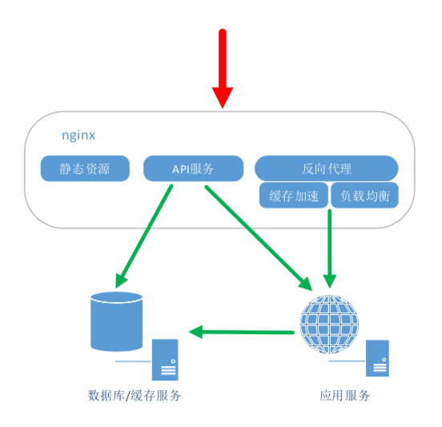

# Nginx初识

[官方网站](http://nginx.org/)

## 主要应用场景

- 静态资源服务：通过本地文件系统提供服务。
- 反向代理服务：Nginx的强大性能；缓存；负载均衡。
  > 正向代理、反向代理？代理的对象不同，分别是客户端和服务端，代理服务器在客户端那边就是正向代理，代理服务器在原始服务器那边就是反向代理。
- API服务：OpenResty。



## 四个主要组成部分

- Nginx二进制可执行文件：由各模块源码编译出的一个文件。
- Nginx.conf配置文件：控制Nginx行为。
- access.log访问日志：记录每一条http请求信息。
- error.log错误日志：定位错误。

## 编译Nginx

这部分若无显式说明，默认cmd都是在源目录：安装路径/nginx-1.16.0/

1. 下载Nginx

  ``` sh
    # 下载
    wget http://nginx.org/download/nginx-1.16.0.tar.gz
    # 解压缩
    tar -xzf nginx-1.16.0.tar.gz
    cd nginx-1.16.0
  ```

2. 目录简介

  ``` sh
  auto
    cc        # 编译相关
    lib       # lib库
    os        # 操作系统，支持模块
  CHANGES     # 版本新增特性和bugfix
  CHANGES.ru  # 因为作者是俄罗斯人
  conf        # 示例文件
  configure   # 脚本文件，生成中间文件，执行编译前的必备动作（安装时候挺常用）
  contrib     # pl脚本和vim工具，如：未做配置时vim编译器没有色彩，执行 cp -r contrib/vim/* ~/.vim (没有目录先新建)
  html        # 默认index页面和50x页面
  man         # 帮助和配置
  src         # Nginx源代码
  LICENSE  
  README
  ```

3. Configure

  即编译时会寻找哪些路径及文件作为辅助文件。如果是选用默认安装，安装完毕后，查看配置`nginx -V`

  ```md
  // 部分截取
  --prefix=/usr/share/nginx --conf-path=/etc/nginx/nginx.conf --http-log-path=/var/log/nginx/access.log --error-log-path=/var/log/nginx/error.log --lock-path=/var/lock/nginx.lock --pid-path=/run/nginx.pid --modules-path=/usr/lib/nginx/modules --http-client-body-temp-path=/var/lib/nginx/body --http-fastcgi-temp-path=/var/lib/nginx/fastcgi --http-proxy-temp-path=/var/lib/nginx/proxy --http-scgi-temp-path=/var/lib/nginx/scgi --http-uwsgi-temp-path=/var/lib/nginx/uwsgi --with-debug --with-pcre-jitz'z'z'z'z'z'z'z'z'z'z'z'z'z'z'z'z'z'z'z'z'z'z
  ```

  ``` sh
  # 查看configure支持参数，中间件如下
  ./configure --help | more
  ```

4. 中间件介绍

- 第一部分：Nginx执行时检索目录作为辅助文件，示例如下：
  - prefix：预设目录
  - modules-path：动态模块
  - lock-path：nginx.lock文件路径
- 第二部分：确认是否使用某些模块
  - with前缀：with前缀的均不会默认编译进Nginx
  - without前缀：without前缀均会默认编译进Nginx
- 第三部分：指定Nginx编译时的特殊参数及添加第三方模块，示例如下：
  - with-cc：设置gcc编译的路径
  - with-debug：打印debug级别的日志

尝试使用默认配置进行配置，并制定预设目录

```sh
./configure --prefix=/usr/local/nginx
```

如下所示，如果没有报错，即表示配置成功（如果出现比如gcc未安装等，百度解决挺方便）。

```md
Configuration summary
  + using system PCRE library
  + OpenSSL library is not used
  + using system zlib library

  nginx path prefix: "/usr/local/nginx"
  nginx binary file: "/usr/local/nginx/sbin/nginx"
  nginx modules path: "/usr/local/nginx/modules"
  nginx configuration prefix: "/usr/local/nginx/conf"
  nginx configuration file: "/usr/local/nginx/conf/nginx.conf"
  nginx pid file: "/usr/local/nginx/logs/nginx.pid"
  nginx error log file: "/usr/local/nginx/logs/error.log"
  nginx http access log file: "/usr/local/nginx/logs/access.log"
  ...
```

在编译完毕后，安装源目录会出现`objs目录`，这是些的中间文件。有个关键文件`ngx_modules.c`，
表示在执行编译时的模块依赖，会输出个`char数组 *ngx_module_names[]`。

5. 编译

执行`make`编译，编译成功如下所示：

```md
sed -e "s|%%PREFIX%%|/usr/local/nginx|" \
	-e "s|%%PID_PATH%%|/usr/local/nginx/logs/nginx.pid|" \
	-e "s|%%CONF_PATH%%|/usr/local/nginx/conf/nginx.conf|" \
	-e "s|%%ERROR_LOG_PATH%%|/usr/local/nginx/logs/error.log|" \
	< man/nginx.8 > objs/nginx.8
make[1]: Leaving directory '/home/abukii/nginx-1.16.0'
```

编译中会生成很多中间文件以及最终的`nginx二进制文件`。查看`./objs`的直接子目录文件：

- nignx二进制文件：因为如果后续nginx版本升级，不能直接`make install`，需要将`./objs/nginx`拷贝到`安装目录`中。
- src：C语言的中间文件都会放在这个目录
- .so文件：如果使用动态模块，会生成.so文件

6. 安装

- 首次安装：`make install`

  这是cd到解析时的`--prefix`目录，我这里是`/usr/local/nginx`，

  - sbin：主要是nginx的二进制文件
  - conf：决定功能的配置文件（是源代码中的conf的完全拷贝）
  - logs：access.log和error.log日志文件
